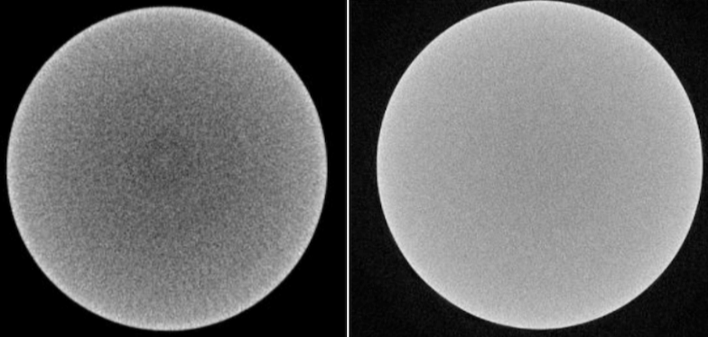
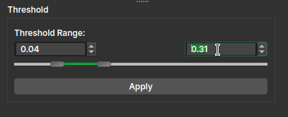

## Gradient Anisotropic Diffusion

Em muitas aplicações, assume-se que transições de uma região clara para uma escura (caracterizadas por um alto gradiente) sejam de interesse. Enquanto outros filtros, como de mediana e gaussiana, frequentemente borram as fronteiras, deixando a delimitação dos poros mais confusa, os filtros de difusão anisotrópica tendem a evitar esse tipo de confusão. O termo de condutância é uma função da magnitude do gradiente da imagem em cada ponto, reduzindo a força da difusão nas bordas.

|                                                                                  |
|:------------------------------------------------------------------------------------------------------------------------:|
| Esquerda: Volume original, sem correção. Direita: Após correção feita com filtro de difusão de gradiente anisotrópico. |

A implementação numérica dessa equação disponível no _GeoSlicer_ é similar à descrita no artigo de Perona-Malik, porém usa uma técnica mais robusta para estimativa da magnitude do gradiente e é generalizado para N-dimensões.

Os parâmetros do módulo para o cálculo do gradiente de difusão anisotrópica são:

- **Condutância** (_Conductance_): Controla a sensibilidade do termo de condutância. Como regra geral, quanto menor o valor, mais fortemente o filtro preservará as bordas. Um alto valor causará difusão (suavização) das bordas. Note que o número de iterações controla o quanto haverá de suavização dentro de regiões delimitadas pelas bordas.

- **Iterações** (_Iterations_): Quanto mais iterações, maior suavização. Cada iteração leva a mesma quantidade de tempo. Se uma iteração leva 10 segundos, 10 iterações levam 100 segundos.

- **Passo temporal** (_Time step_): O passo temporal depende da dimensionalidade da imagem. Para imagens tridimensionais, o valor padrão de de 0.0625 fornece uma solução estável. Na prática, a alteração deste parâmetro causa poucas alterações na imagem.

---

## Curvature Anisotropic Diffusion

Realiza difusão anisotrópica em uma imagem usando uma equação de difusão de curvatura modificada (_Modified Curvature Diffusion Equation_, MCDE).

O MCDE não exibe as propriedades de realce de borda da difusão anisotrópica clássica, que sob certas condições pode sofrer uma difusão "negativa", que aumenta o contraste das bordas. A difusão anisotropica de curvatura sempre sofre difusão positiva, com o termo de condutância variando apenas a força dessa difusão.

Qualitativamente, o MCDE se compara bem com outras técnicas de difusão não linear. É menos sensível ao contraste do que a difusão clássica do tipo Perona-Malik e preserva estruturas mais finas e detalhadas nas imagens. Existe uma potencial desvantagem de velocidade ao usar esta função em vez do *Gradient Anisotropic Diffusion*. Cada iteração da solução leva aproximadamente o dobro do tempo. Menos iterações, no entanto, podem ser necessárias para alcançar uma solução aceitável.

Os parâmetros necessários para o cálculo do gradiente de difusão anisotrópica são os mesmos do método do gradiente anisotrópico.

---

## Gaussian Blur Image Filter

Aplica um filtro de desfoque gaussiano ao volume, o único parâmetro é _Sigma_, representando a largura da gaussiana em unidades de mm.

---

## Median Image Filter

Aplica um filtro de mediana ao volume, o parâmetro _Neighborhood size_ define o tamanho da vizinhança em voxels em cada uma das direções.

---

## Simple Filters

Esse módulo, carregado a partir do 3D Slicer original, apresenta um conjunto diverso de filtros para calcular a morfologia binária e em escala de cinza, remoção de ruído, limiar, manipulação de intensidade da imagem, crescimento de regiões, transformada de Fourier, etc. Para uma explicação mais detalhada de cada uma das opções disponíveis nesse módulo, consulte a documentação [específica](https://slicer.readthedocs.io/en/latest/user_guide/modules/simplefilters.html).

---

## Polynomial Shading Correction

Imagens de tomografia frequentemente apresentam variações nos valores de intensidade que não são características da amostra, mas sim do equipamento que as coletou. Essas variações são chamadas de artefatos, e existem diversos tipos deles. O módulo *Polynomial Shading Correction* corrige o artefato conhecido como _beam hardening_, entre outros. Também é conhecido como correção de _background_. 

|                                                                                  |
|:------------------------------------------------------------------------------------------------------------------------:|
| Esquerda: artefato de _beam hardening_ presente. Direita: imagem corrigida após aplicação de _shading correction_. |

Todo o procedimento descrito a seguir é feito fatia-a-fatia, no plano axial (eixo-z) da amostra.

Para cada fatia, baseado no parâmetro "Number of fitting points", uma amostra aleatória é feita em valores de intensidade, em pontos pertencentes à máscara de sombreamento. Esses pontos são utilizados para o fit de uma função polinomial de segundo grau em duas variáveis, que define o background da imagem:

$$ f(x,y) = a (x-b)^2+c(y-d)^2+e(x-b)+f(y-d)+g(x-b)(y-d) + h $$

A função ajustada é então utilizada para fazer a correção na fatia, seguindo a equação:

$$ s'(x,y) = \frac{s(x,y)}{f(x,y)}M $$
Onde, $s'(x,y)$ é a fatia corrigida, $s(x,y)$ é a original e $M$ é a média de todo o dado na máscara de sombreamento (valor constante).

O fluxo de trabalho do módulo _Shading Correction_ é dividido em três etapas: inicialização, definição da máscara de amostragem e processamento.

#### Inicialização

1.  **Input image:** Selecione a imagem de entrada que deseja corrigir.
2.  **Keep intermediate image:** Marque esta opção se desejar manter a imagem pré-normalizada que é gerada durante a etapa de inicialização. Esta imagem intermediária facilita a etapa de limiarização (_threshold_).
3.  Clique no botão **Initialize**. Isso irá pré-normalizar a imagem de entrada e preparar o editor de segmentos para a criação da máscara de amostragem.

#### Threshold

1.  Após a inicialização, uma interface do editor de segmentos com o efeito **Threshold** será exibida para criar uma máscara que cubra as áreas da imagem afetadas pelo sombreamento. Esta máscara será usada para amostrar os pontos para o ajuste do polinômio.
2.  Após ajustar o limiar, clique em **Apply** no painel do efeito Threshold.

!!!tip
	Leve em consideração o mineral no qual o efeito de _beam hardening_ estiver aparecendo mais claramente. Por exemplo: Se esse for o caso da calcita, basta clicar + arrastar com o mouse próximo de uma região com esse mineral, um circulo amarelo deve aparecer e você deve ver a segmentação colorindo próximo a região, a depender do raio desse círculo.

!!!tip
	Para um ajuste mais fino e sensível da segmentação, vá com o mouse para cima de uma das caixas de seleção com os valores máximo/mínimo e utilize a roleta do mouse para aumentar ou diminuir o limite superior/inferior.
	
	

#### Seleção de Parâmetros

1.  **Slice group size:** Defina o número de fatias que compartilharão a mesma função polinomial ajustada.
2.  **Number of fitting points:** Defina o número de pontos a serem amostrados da máscara para o ajuste da função.
3.  **Output image name:** Insira um nome para a imagem de saída corrigida.

#### Aplicar

1.  **Apply:** Clique para iniciar o processo de correção na imagem de entrada.
2.  **Apply to full volume:** Se a sua imagem de entrada for uma imagem virtual (_lazy node_), este botão estará visível. Clicar nele abrirá o módulo **Polynomial Shading Correction Big Image**, que é otimizado para processar imagens grandes. Os parâmetros definidos neste módulo serão automaticamente transferidos para o módulo de imagem grande.
