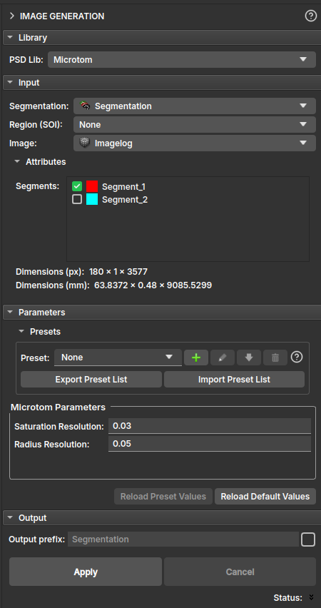
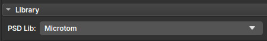
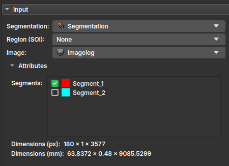
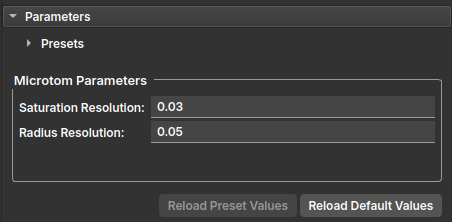
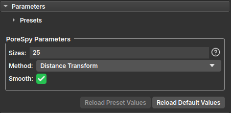
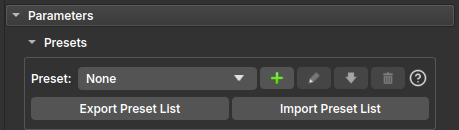
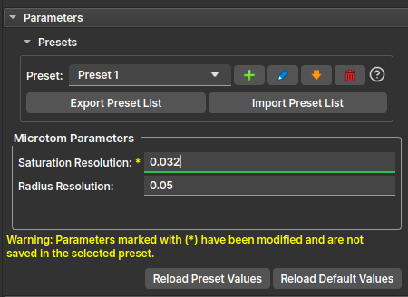
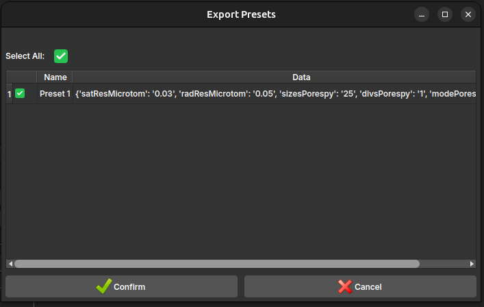
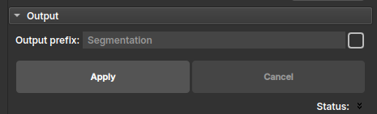
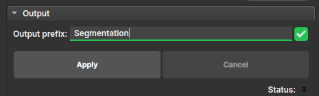

## Image Generation

O módulo **Image Generation** permite analisar uma imagem de perfil de poço segmentada e determinar a Distribuição do Tamanho de Poros (*Pore Size Distribution* - PSD) do perfil. Este módulo oferece duas bibliotecas distintas, Microtom e PoreSpy, cada uma oferecendo diferentes metodologias para calcular o PSD.

### Painéis e sua utilização

|  |
| :---------------------------------------------------------: |
|     Figura 1: Apresentação do módulo Image Generation.      |

#### A interface do módulo Image Generation é organizada em algumas seções

1. **Library:**

    |  |
    | :---------------------------------------------------------: |
    |             Figura 2: Primeira seção - Library.             |

    Nesta seção é selcionada a biblioteca utilizada para o cálculo de PSD.

2. **Input:**

    |  |
    | :---------------------------------------------------------: |
    |              Figura 3: Segunda seção - Input.               |

    - **Segmentation:** Segmentação da imagem de perfil de poço a partir do qual o PSD será calculado.
    - **Region (SOI):** Entrada opcional. Se selecionada a Região de Interesse (*Segment of Interest* - SOI), o cálculo do PSD será limitado a essa região específica da imagem, em vez de processar o perfil inteiro. Isso pode ser útil para focar em intervalos específicos de profundidade ou áreas de interesse dentro do perfil.
    - **Image:** Imagem de perfil de poço.

3. **Parameters:**

    Nesta seção, os parâmetros específicos para a biblioteca selecionada são configurados. Os parâmetros disponíveis mudarão dinamicamente com base na escolha da biblioteca. Os parametros são inicialmente preenchidos com valores padrão, mas o usuário pode modificá-los para atender às suas necessidades. Os parâmetros para cada biblioteca podem ser restaurados clicando no botão '*Reload Default Values*'.

    - **Microtom:**

        |  |
        | :---------------------------------------------------------: |
        |      Figura 4: Terceira seção - Parameters (Microtom).      |

        - **Saturation resolution:** Resolução da saturação calculada. Determina um limite para a discretização da curva PSD na saturação.
        - **Radius resolution:** Resolução dos raios calculados. Determina um limite para a discretização da curva PSD nos raios.

    - **Porespy:**

        |  |
        | :---------------------------------------------------------: |
        |      Figura 5: Terceira seção - Parameters (Porespy).       |

        - **Sizes:** Esta entrada pode ser um número inteiro, uma lista de números inteiros separados por vírgulas (ex: `25` ou `1, 2, 3, 4`) ou ficar fazia. Esse parâmetro é usado apenas pelos métodos `Distance Transform` e `Convolution`. Se uma lista for fornecida, seus valores serão utilizados diretamente. Se um único valor for fornecido, ele definirá a quantidade de pontos igualmente distribuídos entre os valores mínimo e máximo da transformada de distância. Se for vazio, serão utilizados todos os valores únicos da transformada de distância, o que pode aumentar significativamente o tempo de processamento.
        - **Smooth:** Indica se as protuberâncias devem ser removidas das faces das esferas ou não. O valor padrão é `True`.
        - **Method:** Método usado para calcular o resultado:
            - `Distance Transform`: Usa transformadas de distância para realizar erosão e dilatação para cada raio na imagem.
            - `Brute Force`: Usa força bruta para inserir esferas em cada voxel.
            - `ImageJ`: Usa o método de força bruta, mas reduz o número de pontos de inserção em 80–90% para acelerar o processo.
            - `Convolution`: Usa convolução baseada em FFT (Transformada Rápida de Fourier) para realizar erosão e dilatação para cada raio na imagem.

    O usuário também tem a opção de salvar presets de parâmetros para cada biblioteca, o que pode ser útil para reutilizar configurações específicas em diferentes perfis ou projetos. Ao selecionar um preset salvo, os parâmetros correspondentes serão automaticamente preenchidos, facilitando a configuração rápida do módulo para análises futuras.

    |  |
    | :---------------------------------------------------------: |
    |       Figura 6: Terceira seção - Parameters Presets.        |

    Se um preset for selecionado e os campos dos parâmetros forem editado, um aviso aparecerá na tela indicando que o valor no campo está diferente do salvo no preset. Dando ao usuário a opção de salvar os valores modificados ou resetar para os valores salvos no preset clicando no botão '*Reload Preset Values*'

    |  |
    | :---------------------------------------------------------: |
    |  Figura 7: Terceira seção - Parameters Presets (Warning).   |

    Ao exportar ou importar arquivos de presets, o usuário poderá selecionar quais presets serão exportados ou importados.

    |     |
    | :------------------------------------------------------------: |
    | Figura 8: Terceira seção - Parameters Presets (Import/Export). |

4. **Output:**

    |  |
    | :---------------------------------------------------------: |
    |              Figura 9: Quarta seção - Output.               |

    Define o prefixo para o nó de saída. Por padrão o prefixo recebe o mesmo nome do nó de segmentação de entrada com o sufixo `_PSD`.

    |  |
    | :-----------------------------------------------------------: |
    |          Figura 10: Quarta seção - Output (Manual).           |

    O prefixo pode ser manualmente renomeado ativando o check box ao lado do campo.

### Saída

Após a execução bem-sucedida, o módulo gerará uma nova imagem contendo os valores do tamanho dos poros em cada voxel. Ela pode ser usada como entrada no módulo **Histogram Per Depth** para a geração de gráficos de Função de Densidade de Probabilidade (*Probability Density Function - PDF*) dos tamanhos de poro.
