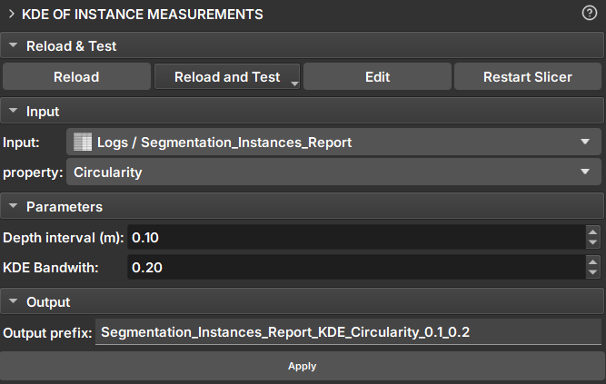

## KDE of instance measurements

O módulo _KDE of instance measurements_ permite calcular a estimativa de densidade de Kernel (KDE) de uma propriedade selecionada, utilizando a tabela de resultados gerada pelo _Imagelog Instance Segmenter_. O cálculo é ajustado de acordo com o intervalo de profundidade e o parâmetro de largura de banda do KDE.

### Painéis e sua utilização

|  |
|:-----------------------------------------------:|
| Figura 1: Apresentação do módulo KDE of instance measurements. |

### Principais opções

- _Input_: Escolha a tabela de resultados da instância do Imagelog.

- _Measurement_: Escolha a medição da instância do Imagelog para calcular o KDE.

- _Depth interval (m)_: Escolha o intervalo de profundidade para agrupar os dados.

- _KDE bandwith_: Largura de banda do KDE que controla a suavidade da curva de densidade estimada.