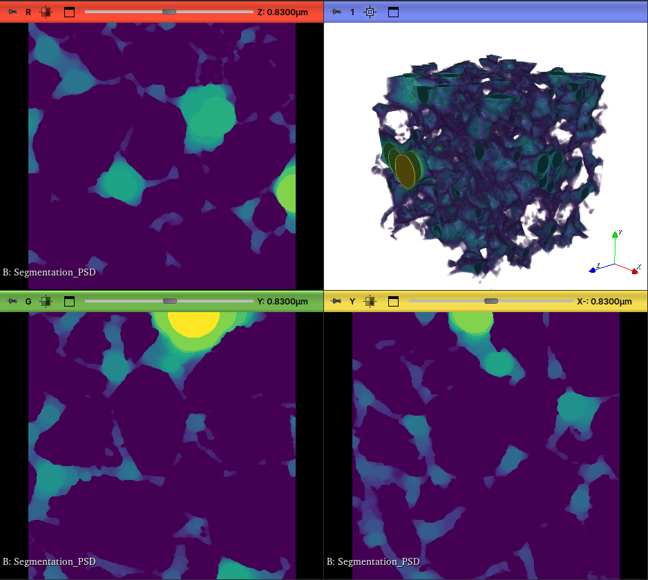
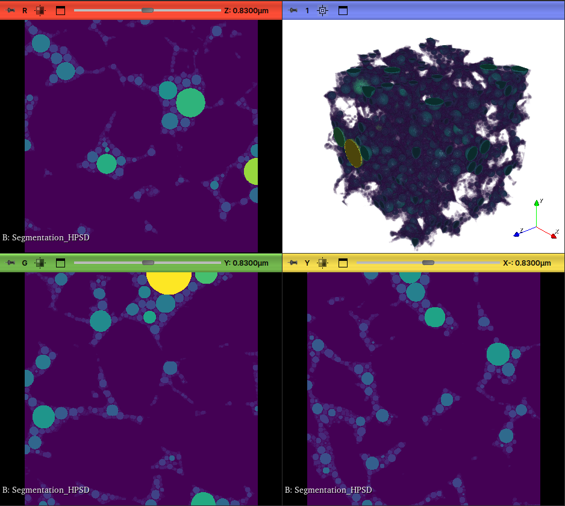
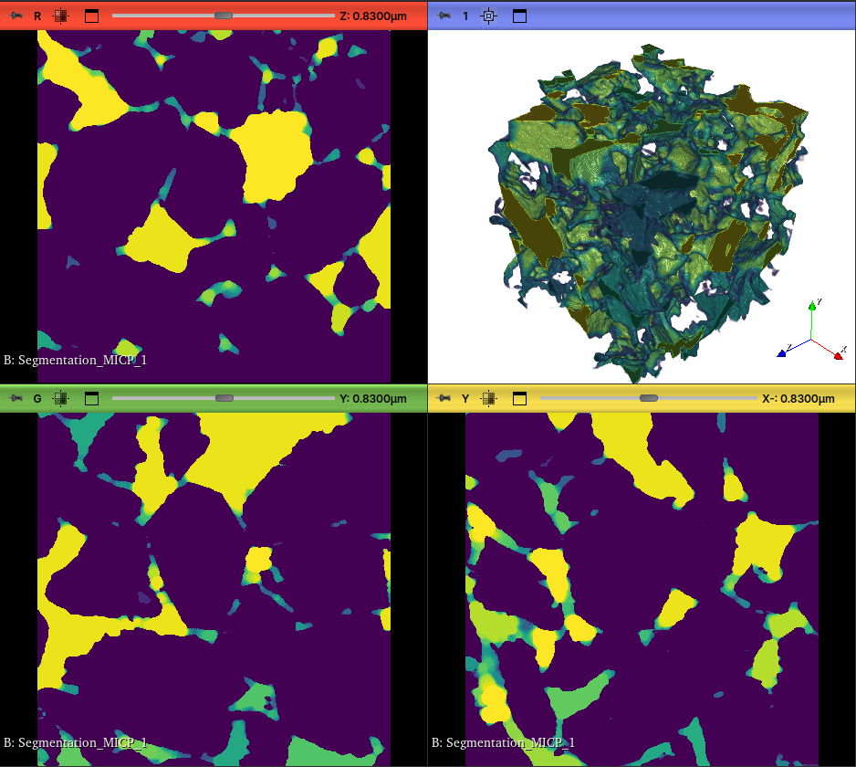

# Microtom

O módulo **Microtom** integra a biblioteca de simulação MicroTom, desenvolvida pela Petrobras, ao *GeoSlicer*. Ele oferece um conjunto de ferramentas avançadas para análise de meios porosos, permitindo a caracterização detalhada de propriedades petrofísicas a partir de imagens digitais.

A seguir, são descritos os principais métodos disponíveis:

## PNM Complete Workflow

Executa o fluxo de trabalho completo do modelo de rede de poros (Pore Network Model), desde a extração da rede até a simulação de propriedades e geração de um relatório interativo.

#### Parâmetros de Entrada:

- Image: Pode ser tanto um Scalar Volume, representando o mapa de porosidade, quanto um LabelMap Volume, representando os poros individualizados. No primeiro caso, será considerado o modelo multiescala enquanto no segundo, será considerado um modelo em escala única (mais simples, desconsidera a porosidade em sub-resolução).
	
- Sensibility Test Parameters: Ao clicar em "Edit", uma janela se abrirá para escolha dos intervalos de parâmetros usados nas simulações, entre eles, os parâmetros que controlam a distribuição dos ângulos de contato, tensão interfacial e outros parâmetros de controle da simulação.

- Modelo da subescala: Quando na simulação multiescala, com a entrada do mapa de porosidade, controla o modelo dos raios dos poros e gargantas atribuídos na sub-resolução.

- Nome do Poço: Identificação usada para facilitar as análises em diversas amostras.

#### Saídas:

- Relatório Streamlit: É adicionado, às páginas de relatório do Streamlit, os resultados das análises feitas sobre essa amostra.

- Nós de Saída: Nós de tabela e do modelo de rede de poros (PNM), assim como os resultados de simulações diversas (permeabilidade absoluta, relativa, injeção de mercúrio) são adicionados à cena do Slicer.

## Pore Size Distribution

Este método analisa uma imagem binária (segmentada) e calcula a distribuição do tamanho dos poros usando o algoritmo de esferas máximas, com base no método das esferas máximas inscritas em um meio poroso binário. O segmento selecionado é considerado como o espaço poroso. É uma forma rápida de caracterizar a geometria do espaço poroso.

#### Parâmetros de Entrada:

- Volume de Entrada: Volume contendo o meio poroso, normalmente, a própria imagem de MicroCT.
- Segmento de Poro: O segmento específico que representa o espaço poroso a ser analisado.
- Saturation Resolution: Define a discretização da saturação na curva de PSD.
- Radius Resolution: Define a discretização dos raios calculados na curva de PSD.
- Saturation correction: Argumento opcional para correção da saturação pela tabela com o mapa de porosidade.

#### Saídas:

- Volume PSD: Um volume mostrando a sobreposição das esferas máximas sobre o espaço poroso.
- Tabela de Distribuição: Uma tabela contendo os raios dos poros em voxel e a saturação estimada de fluido molhante e não molhante.

## Hierarchical Pore Size Distribution

Analisa a distribuição hierárquica de poros distribuídos no espaço poroso. Nesse caso, as esferas serão distribuídas de forma a não se intersectarem.

#### Parâmetros de Entrada:

- Volume de Entrada: Volume contendo o meio poroso, normalmente, a própria imagem de MicroCT.
- Segmento de Poro: O segmento específico que representa o espaço poroso a ser analisado.
- Saturation correction: Argumento opcional para correção da saturação pela tabela com o mapa de porosidade.

#### Saídas:

- Volume PSD: Um volume mostrando a disposição das esferas máximas sobre o espaço poroso.
- Tabela de Distribuição: Uma tabela contendo os raios dos poros em voxel e a saturação estimada de fluido molhante e não molhante.

## Mercury Injection Capillary Pressure

Calcula a pressão capilar de injeção de mercúrio com base nos raios das máximas esferas que preenchem o meio poroso binário e estão conectadas a uma face de entrada.

#### Parâmetros de Entrada:

- Volume de Entrada: Volume contendo o meio poroso, normalmente, a própria imagem de MicroCT.
- Segmento de Poro: O segmento específico que representa o espaço poroso a ser analisado.
- Direction: A direção das faces nas quais analisará a conectividade dos poros.
- Saturation Resolution: Define a discretização da saturação na curva de PSD.
- Radius Resolution: Define a discretização dos raios calculados na curva de PSD.
- Saturation correction: Argumento opcional para correção da saturação pela tabela com o mapa de porosidades.

#### Saídas:

- Volume MICP: Um volume mostrando a pressão capilar estimada pelo método das esferas máximas.
- Tabela: Uma tabela com os valores de raio e a saturação de mercúrio (Snw) correspondente.

## Incompressible Drainage Capillary Pressure 

Simula o processo de drenagem primária, onde um fluido não-molhante desloca um fluido molhante, considerando o fluido incompressível. Neste método, a saturação de água irredutível (Swi) é diferente de zero, pois parte da fase molhante fica aprisionada com o aumento da pressão capilar.

#### Parâmetros de Entrada:

- Volume de Entrada: Volume contendo o meio poroso, normalmente, a própria imagem de MicroCT.
- Segmento de Poro: O segmento específico que representa o espaço poroso a ser analisado.
- Direction: A direção das faces nas quais analisará a conectividade dos poros.
- Saturation Resolution: Define a discretização da saturação na curva de PSD.
- Radius Resolution: Define a discretização dos raios calculados na curva de PSD.
- Saturation correction: Argumento opcional para correção da saturação pela tabela com o mapa de porosidades.

#### Saídas:

- Volume: Um volume mostrando a estimativa do raio capilar estimado pelo método das esferas máximas.
- Tabela: Uma tabela com os valores de raio e a saturação correspondente.

## Imbibition Capillary Pressure

Simula o processo de embebição. O cálculo assume que não há aprisionamento da fase não-molhante (Sor = 0), que é totalmente deslocada à medida que a pressão capilar diminui.

#### Parâmetros de Entrada:

- Volume de Entrada: Volume contendo o meio poroso, normalmente, a própria imagem de MicroCT.
- Segmento de Poro: O segmento específico que representa o espaço poroso a ser analisado.
- Direction: A direção das faces nas quais analisará a conectividade dos poros.
- Saturation Resolution: Define a discretização da saturação na curva de PSD.
- Radius Resolution: Define a discretização dos raios calculados na curva de PSD.
- Saturation correction: Argumento opcional para correção da saturação pela tabela com o mapa de porosidades.

#### Saídas:

- Volume: Um volume mostrando a estimativa do raio capilar estimado pelo método das esferas máximas.
- Tabela: Uma tabela com os valores de raio e a saturação correspondente.

## Incompressible Imbibition Capillary Pressure

Simula o processo de embebição considerando o aprisionamento da fase não-molhante (Sor > 0), o que é mais representativo de processos reais em meios porosos, à medida que a pressão capilar diminui.

#### Parâmetros de Entrada:

- Volume de Entrada: Volume contendo o meio poroso, normalmente, a própria imagem de MicroCT.
- Segmento de Poro: O segmento específico que representa o espaço poroso a ser analisado.
- Direction: A direção das faces nas quais analisará a conectividade dos poros.
- Saturation Resolution: Define a discretização da saturação na curva de PSD.
- Radius Resolution: Define a discretização dos raios calculados na curva de PSD.
- Saturation correction: Argumento opcional para correção da saturação pela tabela com o mapa de porosidades.

#### Saídas:

- Volume: Um volume mostrando a estimativa do raio capilar estimado pelo método das esferas máximas.
- Tabela: Uma tabela com os valores de raio e a saturação correspondente.

## Absolute Permeability

!!!note
	Código-fonte fechado, disponível apenas no ambiente da Petrobras.

Calcula a permeabilidade absoluta da amostra simulando o escoamento de um fluido monofásico através da rede de poros, por meio de uma simulação de escoamento de Stokes. A simulação resolve as equações de Stokes para o fluxo em cada poro.

## Absolute Permeability - Representative Elementary Volume

!!!note
	Código-fonte fechado, disponível apenas no ambiente da Petrobras.

Este método ajuda a determinar o Volume Elementar Representativo (REV) para a permeabilidade absoluta. Ele executa o cálculo de permeabilidade absoluta em múltiplos subvolumes de tamanhos crescentes e plota o resultado, permitindo verificar a partir de que tamanho de amostra a propriedade se torna estatisticamente estável.

## Absolute Permeability - Darcy FOAM

!!!note
	Código-fonte fechado, disponível apenas no ambiente da Petrobras.

Simula o fluxo pelo meio poroso a partir de um mapa de permeabilidades, em que cada voxel terá um valor de permeabilidade. Utiliza um solver próprio desenvolvido pela Petrobras.

## Relative Permeability

!!!note
	Código-fonte fechado, disponível apenas no ambiente da Petrobras.

Simula o escoamento bifásico (por exemplo, óleo e água) em uma rede de poros para calcular as curvas de permeabilidade relativa. Utiliza um solver próprio desenvolvido pela Petrobras.
