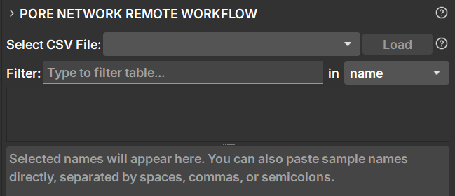
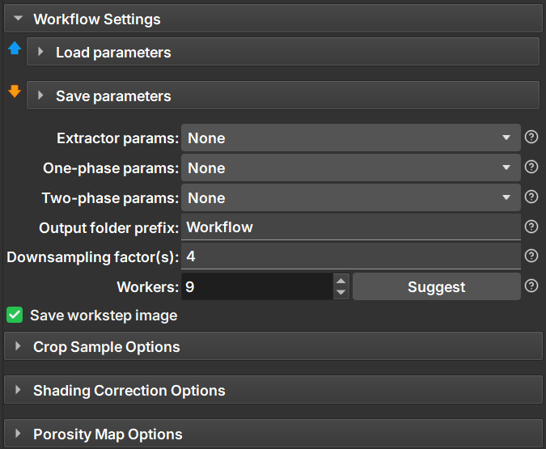

## Remote Workflow

O módulo **Pore Network Remote Workflow** fornece um pipeline automatizado ponta a ponta para o processamento em lote de volumes brutos de amostras de micro-CT em um cluster de computação remota. Ele coordena o carregamento de dados brutos, recorte adaptativo da amostra, correção de artefatos de sombreamento, geração do mapa de porosidade e extração da rede de poros em multiescala, finalizando com as simulações monofásica e bifásica.

Ao utilizar o agendamento distribuído do **Dask** sobre um **Cluster SLURM**, o workflow paraleliza tarefas em várias instâncias, tornando grandes estudos de sensibilidade gerenciáveis a partir de um único painel.

---

### Listagem e Seleção de Amostras

|  |
|----------------------------------------------------------------------------------------|
| **Figura 1:** Seletor principal de dados e tabela de filtragem de amostras.                           |

* **Select CSV File / Load:** Selecione o arquivo de índice de dados (por exemplo, `All`) e clique em **Load** para preencher a lista de amostras.
* **Filter:** Consulte dinamicamente as amostras carregadas por:
    * `name`
    * `codigo_amostra`
    * `tipo_amostra`
    * `phi` (porosidade absoluta medida experimentalmente, se disponível)

* **Seleção da Amostra:** Clique duas vezes em qualquer linha da tabela filtrada para adicionar o nome da amostra à caixa de seleção abaixo. Os nomes das amostras também podem ser colados ou editados manualmente usando espaços, vírgulas ou pontos e vírgulas como separadores.

---

### Configurações do Workflow

|  |
|------------------------------------------------------------------------------------------------|
| **Figura 2:** Configurações do workflow.                                                               |

As seções **Load parameters** e **Save parameters** permitem que a configuração completa do Remote Workflow seja armazenada como nós de parâmetros reutilizáveis dentro da cena atual do GeoSlicer. Isso permite que configurações inteiras de workflow sejam salvas, compartilhadas e restauradas sem a necessidade de reconfigurar manualmente a interface.

##### Save parameters

A seção **Save parameters** armazena a configuração atual do workflow como um novo nó de parâmetros do Remote Workflow.

* **Output parameter node name:** Especifica o nome do nó de parâmetros a ser criado.
* **Save parameters:** Salva a configuração atual do workflow na cena.

O nó de parâmetros gerado aparece na cena e pode ser selecionado posteriormente na seção **Load parameters**.

##### Load parameters

A seção **Load parameters** restaura uma configuração do Remote Workflow salva anteriormente.

* **Input parameter node:** Seleciona um nó de parâmetros do Remote Workflow salvo anteriormente.
* **Load parameters:** Restaura todas as configurações salvas na interface atual.

> **Nota:** Os nós de parâmetros do Remote Workflow armazenam referências a nós de parâmetros existentes da Extração e Simulação. Se um nó de parâmetros referenciado não estiver mais presente na cena atual, seu seletor correspondente permanecerá vazio.

#### Parâmetros de Processamento

* **Extractor params:** Seleciona os parâmetros de extração usados para gerar a rede de poros.
* **One-phase params:** Seleciona os parâmetros usados para a simulação monofásica.
* **Two-phase params:** Seleciona os parâmetros usados para a simulação bifásica.

> **Nota:** As simulações monofásicas e bifásicas são executadas apenas quando a opção **Extractor params** está selecionada.

> 💡 **Como os Nós de Parâmetros são Gerados**
> Os nós de parâmetros disponíveis nos seletores **Extractor params**, **One-phase params** e **Two-phase params** são criados a partir dos módulos **Pore Network Extractor** e **Pore Network Simulation**.
> Configure as definições desejadas nesses módulos, expanda a seção **Save parameters** e clique em **Save parameters** para criar nós de parâmetros reutilizáveis.
> Os nós de parâmetros do **Remote Workflow** criados por este módulo são objetos distintos. Eles armazenam a configuração do workflow juntamente com referências aos nós de parâmetros do extrator e de simulação selecionados, permitindo que toda a configuração do workflow seja restaurada com um único clique.

* **Output Folder Prefix:** Adiciona uma string de identificação personalizada ao nome do diretório de saída do workflow.
* **Downsampling Factor(s):** Aceita uma lista de valores separados por vírgula (por exemplo, `2`, `4.5`, `6`). Um workflow separado é gerado para cada fator especificado.
* **Workers:** Define o número máximo de amostras processadas simultaneamente no cluster. O botão **Suggest** calcula automaticamente o número recomendado de workers com base no número de amostras selecionadas e nos fatores de subamostragem.
* **Save workstep image:** Controla se imagens intermediárias das etapas de trabalho são geradas e armazenadas para inspeção.

---

### Opções de Recorte da Amostra

Quando as amostras não preenchem o campo visual ou exibem degradação nas bordas, a etapa **Crop Sample** isola o volume de rocha válido.

#### Métodos de Recorte

* **Method:** Especifica o método usado para isolar o volume de rocha.
* **Auto:** O workflow analisa os limites do volume de micro-CT para escolher automaticamente a estratégia de recorte mais adequada:
    * Se a amostra preencher a imagem, mas exibir atenuação nos cantos, a opção **Cylindrical crop** é selecionada.
    * Se a amostra terminar antes dos limites da imagem, a opção **Sample segmentation** é selecionada.
    * Caso contrário, o recorte é ignorado.

* **Cylindrical Crop:** Aplica uma máscara cilíndrica. As coordenadas do centro utilizam por padrão o centro detectado da amostra. O raio pode ser reduzido automaticamente usando o parâmetro **Reduction (%)**.
* **Sample Segmentation:** Utiliza uma segmentação Multi-Otsu de 3 fases seguida por processamento morfológico para separar a rocha do fundo e remover artefatos.

* **Discard bottom/top:** Remove uma porcentagem configurável (0–45%) das extremidades inferior e superior da amostra ao longo do eixo Z.

Assim que a máscara de recorte é gerada, o workflow recorta a imagem para a menor caixa delimitadora (*bounding box*) que envolve a amostra selecionada.

---

### Opções de Correção de Sombreamento

Corrige gradientes de iluminação e artefatos do feixe de raios-X (*beam hardening*).

* **Function:** Especifica o modelo de correção:
* **Auto:** Avalia os limites da amostra e os resultados do recorte para selecionar o modelo de correção mais adequado.
    * Se for um recorte cilíndrico ou se limites parciais da amostra forem detectados, a opção **Polynomial Radial** é selecionada.
    * Se nenhum recorte de amostra for necessário, a opção **Spline Radial** é selecionada.

* **Polynomial:** Ajusta um polinômio convencional.
* **Polynomial Radial:** Restringe o ajuste polinomial a um modelo radialmente simétrico.
* **Spline Radial:** Aplica uma função baseada em spline radialmente simétrica.
* **Order:** Especifica a ordem do polinômio (2, 4 ou 6) quando um modelo polinomial é selecionado.
* **Slice Group Size:** Número de fatias consecutivas que compartilham o mesmo modelo de correção ajustado.
* **Fitting Points (%):** Porcentagem de pixels da máscara usados para estimar a superfície de correção.
* **Mask Percentile Min/Max:** Define o intervalo percentil de intensidade usado para estimar a máscara de correção.

---

### Opções do Mapa de Porosidade

Esta etapa gera o mapa de porosidade necessário para a extração da rede de poros em multiescala.

* **Gradient Anisotropic Diffusion (GAD):** Filtro opcional de suavização com preservação de bordas que reduz o ruído enquanto preserva os limites dos poros.
* **Métodos de Geração do Mapa de Porosidade**
    * **Porosidade experimental disponível:** Utiliza a porosidade experimental carregada do banco de dados para calibrar o mapa de porosidade.
    * **Porosidade experimental indisponível:** Utiliza uma segmentação Multi-Otsu de três classes para estimar a porosidade de macro e sub-resolução.
* **Otsu Threshold Shifts:** Permite o ajuste manual (±15%) dos limiares de Multi-Otsu quando não há porosidade experimental.

---

### Interface da Aba Remote Jobs

Quando o **Apply** ou o **Visualize** é executado, o workflow é submetido ao cluster remoto como um único trabalho principal (*PNM Workflow: <prefix>*). O progresso pode ser monitorado na aba **Remote Jobs**.

Clicar com o botão direito em uma entrada do workflow fornece as seguintes ações:

* **Open:** Baixa todas as amostras concluídas disponíveis no momento sem esperar que todo o workflow termine.
* **Details:** Exibe informações do trabalho, identificadores do SLURM, caminhos de execução e parâmetros armazenados.
* **Reconnect:** Reconecta ao agendador remoto após interrupções de comunicação.
* **Cancel/Delete:** Encerra o workflow e remove os trabalhos associados no cluster.

---

### Coleta de Dados

Quando os resultados do workflow são abertos, o GeoSlicer reconstrói automaticamente a hierarquia do projeto:

1. **Cria o diretório do workflow:** `<Prefix>_<Workflow_ID>`.
2. **Cria os diretórios das amostras:** `<Sample_Name_Stem>`.
3. **Cria um diretório para cada fator de subamostragem (`DS_<Factor>_R<Index>`):**
    * Parêmetros do Workflow
    * Dados Experimentais de Krel
    * Nós de Imagem de Workstep:
        * `Sample`
        * `Cropped_Sample`
        * `Cropped_Sample_Mask`
        * `Shading_Correction`
        * `Shading_Mask`
        * `GAD_Pre_Porosity_Map`
        * `Porosity_Map`
    * Nós de Extração da Rede
    * Nós de Simulação Monofásica
    * Nós de Simulação Bifásica

4. **Cria nós de análise de resolução agregados** para comparar múltiplos fatores de subamostragem.

---

### Guia de Execução Passo a Passo

1. **Gerar nós de parâmetros**
    * Configure o módulo **Pore Network Extractor** e salve seu nó de parâmetros.
    * Configure o módulo **Pore Network Simulation** e salve os nós de parâmetros monofásicos e/ou bifásicos desejados.

2. **Carregar o banco de dados**
    * Abra o **Pore Network Remote Workflow**.
    * Selecione o repositório CSV desejado e clique em **Load**.

3. **Selecionar amostras**
    * Filtre a lista de amostras.
    * Clique duas vezes nas amostras desejadas ou cole os nomes das amostras na caixa de seleção.

4. **Configurar o workflow**
    * Opcionalmente, carregue uma configuração do Remote Workflow salva anteriormente.
    * Selecione os nós de parâmetros de Extrator, Monofásico e Bifásico.
    * Configure os fatores de subamostragem, a quantidade de workers e as opções de pré-processamento.

5. **Executar o workflow**
    * Clique em **Apply** para submeter o workflow ao cluster.
    * Clique em **Visualize** para realizar uma execução apenas para visualização.

6. **Monitorar a execução**
    * Abra a aba **Remote Jobs**.
    * Use o **Open** a qualquer momento para recuperar as amostras concluídas enquanto as tarefas restantes continuam sendo processadas.