# Segmentação Automática (Thin Section)

Dentro do contexto de segmentação de imagens de lâminas petrográficas obtidas por fotomicrografia, existem duas abordagens de segmentação. A mais simples consiste na identificação da fase de poro, nesta abordagem todo o restante da imagem é considerada não-poro. Por outro lado, a abordagem mais complexa é a identificação das múltiplas fases que compõem a fase não-poro. Esta abordagem é comumente denominada de segmentação multifásica, ou multi-mineralógica, pois o segmento não-poro é em geral composto de diversos minerais que compõem a rocha.

## Segmentação Multifásica/Minerais

Entender a mineralogia das rochas sedimentares, isto é, sua composição em termos de minerais e texturas, é uma tarefa relevante para o mercado de petróleo, uma vez que aspectos como porosidade, permeabilidade e distribuição mineral das formações rochosas indicam a possibilidade de extração petrolífera do local e a provável qualidade do petróleo presente.

Uma forma de se estudar a mineralogia de uma rocha é obter uma lâmina de seção fina de uma pequena amostra e aplicar sobre ela o método QEMSCAN (Quantitative Evaluation of Materials by Scanning Electron Microscopy). A técnica consiste em determinar qual mineral está presente em cada parte da lâmina de acordo com o sinal produzido pela sua reação a um feixe de elétrons.

Embora poderoso, o QEMSCAN depende da manipulação precisa de equipamentos e sistemas, dentre outras limitações, as quais abrem espaço para o uso de modelos capazes de reproduzir os resultados do QEMSCAN utilizando modernos algoritmos de visão computacional aplicados sobre imagens de lâmina. O uso de tais modelos é facilitado ao usuário pela interface do GeoSlicer.

### Rede Neural Convolucional

As redes neurais artificiais pré-alimentadas mais simples que existem são as multi-layer perceptrons (MLPs), que tradicionalmente nada mais são do que empilhamentos alternados de transformações lineares com pesos treináveis e operações ativação simples que possibilitam que o modelo compreenda relações não-lineares nos dados. Tais modelos podem aprender padrões muito complexos em dados tabulares, mas têm limitações ao lidar com imagens ou volumes. Isto acontece porque estas redes ignoram a posição espacial de um pixel com relação aos outros, e por isso têm dificuldade em compreender contexto para além da primeira dimensão. As redes convolucionais surgem como a alternativa mais simples e eficiente para lidar com dados espaciais em grades regularmente espaçadas. Sua configuração mais básica é muito próxima à da MLP, exceto que as transformações lineares são janeladas – uma convolução nada mais é que uma transformação linear aplicada numa janela deslizante. Desta forma, a previsão de um pixel passa a depender de outros que estão em torno dele, em todas as suas dimensões espaciais. Além disso, por conta do janelamento, partimos da premissa plausível que pixels muito distantes uns dos outros não tem boa correlação. Este ponto é importante, pois uma vez que tais pixels podem ser ignorados da análise, torna-se acessível produzir um modelo muitas vezes mais complexo (em número de camadas e número de ativações), ainda que mantendo-se um modelo pequeno (baixo número de parâmetros).

#### Arquitetura U-Net

A U-net é uma rede neural convolucional que foi introduzida em 2015 por Ronnenberger et al.. Ela se tornou a base para modelos estado-da-arte em segmentação semântica de imagens e volumes, sendo capaz de atribuir uma classe para cada pixel da imagem, delimitando precisamente a região em que cada elemento se encontra. A U-net é formada por três ideias principais: filtros convolucionais treináveis que realçam feições visuais, análise multi-escala e conexões de salto intra-escala, que vão das etapas de processamento anteriores às posteriores, formando o grafo da rede em formato de "U". A primeira etapa da rede codifica, em resoluções cada vez menores, as principais características extraídas da imagem, enquanto a segunda etapa decodifica a informação gradualmente, gerando o mapa de segmentação da imagem à medida que recupera sua resolução original. A U-net pode ser utilizada tanto para regressão de propriedades como para segmentação, e seus hiper-parâmetros importantes incluem o número de escalas, o número de operações de convolução por escala, o tamanho dos filtros de convolução e as funções de ativação entre as operações, que têm o objetivo de tornar a modelo capaz de entender relações não-lineares entre as entradas e as saídas.

| 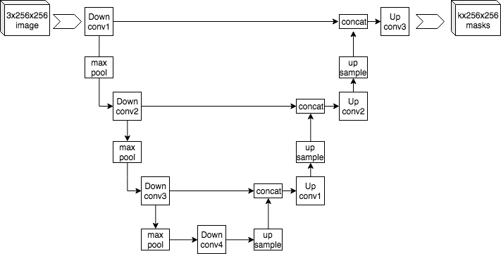 |
|:-----------------------------------------------:|
| Figura 1: Arquitetura exemplo da U-Net. Por Mehrdad Yazdani - [U-Net](https://commons.wikimedia.org/wiki/File:Example_architecture_of_U-Net_for_producing_k_256-by-256_image_masks_for_a_256-by-256_RGB_image.png), [CC BY-SA 4.0](https://creativecommons.org/licenses/by-sa/4.0/).

O GeoSlicer oferece modelos baseados em U-Net para a segmentação mineralógica de imagens de lâmina de seção fina, possibilitando a identificação de poros e minerais como calcita, dolomita, argilas e quartzo.

#### Treinamento

O treinamento dos modelos de segmentação baseados em U-Net foi feito sobre imagens em alta resolução de mais de 50 lâminas, utilizando fotografias em escala micrométrica iluminadas tanto por Luz Natural (PP) quanto por Polarização Cruzada (PX). O resultado do QEMSCAN aplicado sobre cada lâmina foi usado como resposta esperada a ser aproximada pela rede.

As imagens PP e PX não necessariamente são fornecidas na mesma orientação. Além disso, a imagem QEMSCAN é gerada em resolução e orientação diferentes das lâminas. Por isso, cada lâmina teve que ser submetida ao processo de referenciamento/registro, isto é, ao alinhamento espacial das três imagens. O processo de referenciamento é disponibilizado no GeoSlicer a partir da aba Registration no ambiente do Thin Section. Além disso, foi delimitada para cada lâmina uma região de interesse (SOI - *Segment of Interest*), de modo a focar o aprendizado da rede sobre a área útil da lâmina, minimizando bordas e falhas. A Figura 2, mostra um dos resultados desse processo.

| 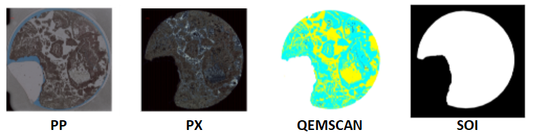 |
|:-----------------------------------------------:|
| Figura 2: Imagens PP, PX, QEMSCAN e SOI antes (acima) e depois (abaixo) do referenciamento.

Para uma maior variedade de dados e facilidade de processamento, as lâminas foram divididas em recortes de 1000² *pixels*, considerando apenas recortes com pelo menos 70% de área útil de acordo com o SOI. Durante o treinamento, os recortes passavam pelos seguintes processos de aumento aleatório, para diversificação dos dados aprendidos:

- Sub-recorte de uma área aleatória de 512² pixels;
- Inversão ou não sobre o eixo horizontal;
- Inversão ou não sobre o eixo vertical;
- Rotação em um múltiplo de 90º.

Dada a quantidade relativamente baixa de lâminas, dois métodos de validação foram testados:

|Método de validação | Conjunto de treino | Conjunto de validação |Justificativa|
|:-------:|:-------:|:-------:|:-------:|
|1 | Porção maior de cada lâmina | Porção menor de cada lâmina, sem interseção com a porção de treino | Maior variabilidade de dados de treinamento|
|2 | Subconjunto maior de lâminas | Subconjunto menor de lâminas, sem interseção com o subconjunto de lâminas de treino | Melhor noção da generalização do modelo para lâminas desconhecidas|

###### Tabela 1: Métodos de validação utilizados.

Os modelos Textura Fina e Textura Densa foram validados apenas pelo método 1, dada a pequena quantidade de lâminas. 

Dada a distribuição dos minerais e poros ao longo do conjunto de dados, os modelos foram treinados para identificação de **Poros** e dos minerais **Calcita (0% a 1%MgO)**, **Dolomita**, **Mg-Argilominerais**, **Quartzo** e dos demais minerais como uma única classe denominada **Outros**.

|  |
|:-----------------------------------------------:|
| Figura 3: Distribuição dos poros e minerais no conjunto de dados.

Como métricas de avaliação, foram considerados: o coeficiente de Dice, que determina a sobreposição entre a segmentação esperada e a obtida; a correlação linear entre as distribuições dos poros/minerais no QEMSCAN e na segmentação obtida; e a matriz de confusão, que avalia como cada classe está sendo interpretada pelos modelos. Feitos os experimentos cabíveis, um modelo final para cada contexto (Textura Fina, Textura Densa e Completo) foi treinado com todos os dados correspondentes.

#### Resultados

A seguir, os resultados relativos a cada um dos modelos, de acordo com o método de validação considerado. A correlação foi determinada em termos do coeficiente de determinação (R²), que indica melhor linearidade quanto mais próximo de 1.0, e da raiz do erro quadrático médio (RMSE). Cada célula da matriz de confusão, por sua vez, se aproxima mais da cor branca quanto maior for a quantidade de pixels da classe real (linha) classificada como pertencendo à classe predita (coluna). A matriz ideal teria toda a diagonal principal em cor branca e as demais células em cor preta

##### Textura Fina - método de validação 1:

- Dice: 38.67%.

| 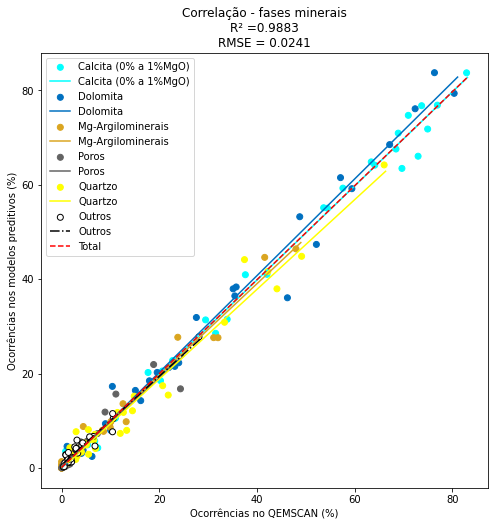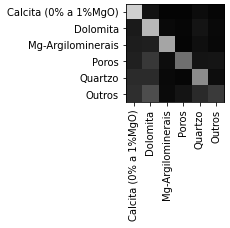 |
|:-----------------------------------------------:|
| Figura 4: Modelo Textura Fina: resultados de validação - método 1.

##### Textura Densa - método de validação 1:

- Dice: 43.50%.

| 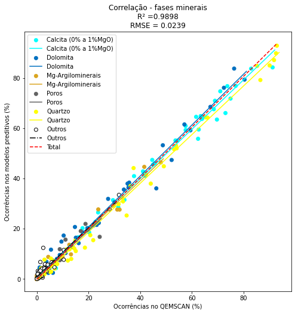 |
|:-----------------------------------------------:|
| Figura 6: Modelo Textura Densa: resultados de validação - método 1.

##### Completo - método de validação 1:

- Dice:
	- validado no conjunto de dados completo: 38.67%;
	- validado no conjunto de dados de textura fina: 35.70%;
	- validado no conjunto de dados de textura densa: 43.15%.

|  |
|:-----------------------------------------------:|
| Figura 7: Modelo Completo: resultados de validação - método 1.

##### Completo - método de validação 2:

- Dice: 35.79%.

| 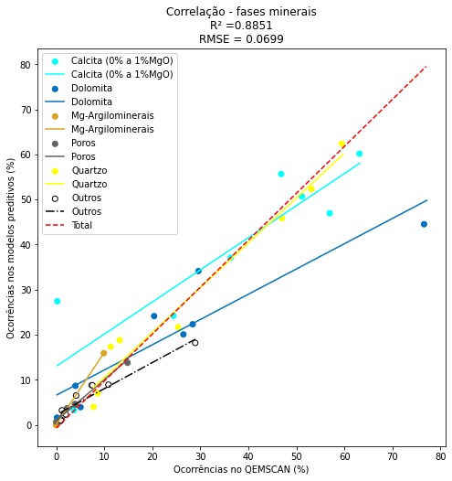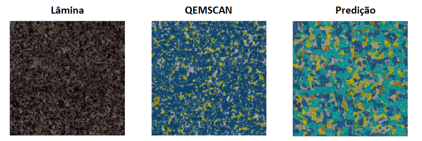 |
|:-----------------------------------------------:|
| Figura 8: Modelo Completo: resultados de validação - método 2.

A Figura 9 a seguir mostra, na parte superior, o comportamento da função de custo e da métrica de Dice dos modelos validados pelo método 1. A baixa suavidade das curvas de validação se deve ao fato de que a validação foi feita em intervalos grandes entre as iterações de treinamento. Na parte inferior, os gráficos referentes ao modelo Completo com validação tipo 2 (treinado em uma etapa anterior, e com mais etapas de validação). 

| 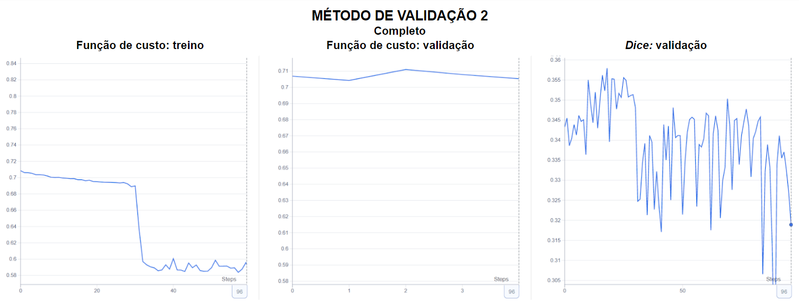 |
|:-----------------------------------------------:|
| Figura 9: Gráficos de aprendizagem dos modelos. Superior: validados pelo método 1; Inferior: validados pelo método 2.

Nota-se que tanto os custos de treinamento quanto de validação se estabilizam em valores próximos a 0,7, o que indica que de fato houve aprendizagem sem notável subajuste ou sobreajuste aos dados. Em alguns casos a função de custo de treinamento sofre uma queda abrupta, provavelmente devido ao escalonamento da taxa de aprendizagem, porém os modelos já atingem seu máximo valor de métrica de validação antes disso.

A seguir, alguns resultados obtidos com os modelos finais, já integrados ao GeoSlicer, sobre lâminas nunca antes tratadas durante o treinamento e validação dos modelos:

| 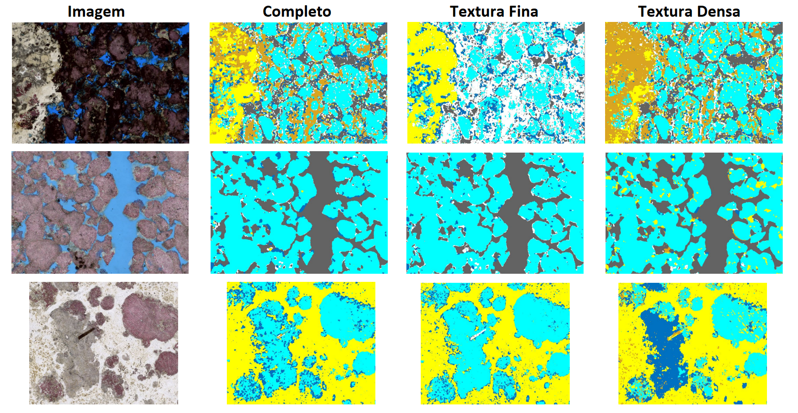 |
|:-----------------------------------------------:|
| Figura 10: Predição dos modelos finais sobre lâminas desconhecidas.

#### Discussão e limitações

No geral, os resultados revelam alguns insights importantes:

- Os valores de Dice indicam níveis de sobreposição um tanto limitados entre o "real" (QEMSCAN) e o predito;
- Por outro lado, os gráficos de correlação mostram que a distribuição predita dos poros e minerais tem uma correspondência satisfatória com a realidade, sobretudo com respeito ao método de validação 1. Com o método 2, a métrica é um pouco comprometida, mas ainda é numericamente satisfatória;
- No geral, as matrizes de confusão tem a diagonal destacada, porém apresentam dificuldade especialmente com a classe Outros. Além disso, parece haver uma certa concentração de predições em duas classes muito frequentes no conjunto de dados, Calcita e Dolomita, o que indica que os modelos podem ter aprendido mais sobre elas e menos sobre as classes menos frequentes;
- As imagens mostram que as predições tendem a ser “mais suaves” do que o QEMSCAN correspondente. Comparando-se o exemplo de predição da Figura 5 com o primeiro exemplo da Figura 7, nota-se que o modelo dedicado à Textura Fina parece atender melhor uma lâmina com esse tipo de textura do que o modelo Completo, o que é confirmado pelo valor de Dice 3% maior (38,67% x 35,70%). Além disso, comparar o exemplo da Figura 8 com o último da Figura 7 mostra um desempenho notavelmente superior do método de validação 1, o que é confirmado pelos gráficos de correlação.

Acredita-se que problemas apontados nos resultados gerais são decorrentes das seguintes limitações:

- O processo de referenciamento/registro introduz duas dificuldades inerentes: (i) o alinhamento de imagens de resoluções originalmente diferentes, visto que o QEMSCAN tem resolução muito inferior à das imagens de lâmina; e (ii) a dificuldade de se posicionar uma imagem perfeitamente sobre a outra. A combinação desses dois fatores faz com que muitos pixels do QEMSCAN fiquem levemente desalinhados em relação aos seus reais correspondentes nas lâminas, o que se destaca principalmente nos limites entre diferentes minerais e nas áreas em que um mineral aparece de forma mais granular, dificultando o aprendizado da rede. Isso explica o fato de que as predições aproximam bem o QEMSCAN e, por consequência, as distribuições dos minerais, mas ao mesmo tempo têm transições muito mais suaves e, por isso, apresentam baixo valor de Dice;
- A quantidade e variedade de lâminas usadas para treinamento são muito pequenas, o que limita a capacidade de generalização, sobretudo com respeito ao método de validação 2, que exclui algumas lâminas do treinamento para usá-las como validação. Alguns minerais podem não ter sido suficientemente representados, levando-os a serem preditos erroneamente em algumas ocasiões, como mostram as matrizes de confusão. A classe Outros, sobretudo, aparece pouco frequentemente e de forma predominantemente granular, dificultando seu reconhecimento. 

Essas são as limitações que podem ser enfrentadas quando um modelo de segmentação mineralógica é utilizado pelo GeoSlicer. No entanto, nota-se que atualmente os modelos já trazem boas aproximações, sobretudo quando se pretende estudar texturas menos granulares e/ou a distribuição das fases minerais. Além disso, vale ressaltar que os modelos finais disponibilizados foram treinados com uma quantidade ainda maior de dados, visto que não houve exclusão de uma parte para validação.

## Segmentação Poro/Não-poro

A porosidade da rocha é um aspecto geológico importante para a determinação do quão favorável é o encontro e a extração de petróleo. Extraindo-se uma lâmina de seção fina de uma pequena amostra de rocha, pode-se aproximar o nível de porosidade da formação rochosa.

Uma forma de destacar os poros de uma amostra para melhor inspeção visual é o preenchimento do espaço com uma resina de coloração distinta dos padrões encontrados na rocha. A imagem a seguir mostra um recorte de lâmina com porosidade preenchida por resina de cor azul.

|  |
|:-----------------------------------------------:|
| Figura 11: Recorte de lâmina com porosidade preenchida por resina de cor azul.

Através do GeoSlicer, é possível fazer uma análise computacional da porosidade de uma lâmina através da segmentação por limiar de cores. Isso significa que, ao se definir limiares mínimos e máximos para cada componente RGB ou HSV de uma imagem de lâmina, o software destaca as regiões da imagem compreendidas dentro desses limiares, o que pode ser aplicado sobre a faixa de coloração da resina. Porém, esse tipo de segmentação envolve uma investigação manual e subjetiva dos melhores limiares e está limitada às condições de resolução e iluminação da imagem e ao tipo de resina empregado. Isso torna conveniente o uso de técnicas capazes de distinguir os poros de uma lâmina através não somente de seu nível de coloração como também de seu aspecto físico e da textura rochosa que o envolve, como a Inferência Bayesiana ou o uso de Redes Neurais Convolucionais, método que será tratado nesta página.

### Redes Neurais Convolucionais

Assim como nos estudos de segmentação multi-fásica de lâminas e segmentação de dados de Micro-CT, a arquitetura U-Net também foi utilizada para segmentação de poros. 

#### Treinamento

O estudo aqui descrito envolveu um total de 85 imagens de lâminas, com resolução normalmente em torno de 2000 pixels de altura e 3000 de largura. A resposta esperada da rede, isto é, a segmentação de poros que a rede deveria aproximar, era a segmentação por limiar de cores feita previamente sobre as lâminas disponíveis. Além disso, a cada lâmina foi atribuída uma região de interesse (SOI - *Segment of Interest*) que delimita a área da lâmina considerada útil para o estudo.

| 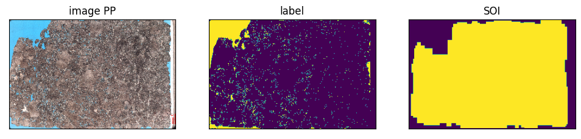 |
|:-----------------------------------------------:|
| Figura 12: À esquerda: exemplo de lâmina; ao centro: em amarelo, segmentação das regiões compreendidas pela resina azul na lâmina; à direita: em amarelo, região de interesse (SOI) da lâmina.

A fim de ampliar o conjunto de dados e diminuir o esforço computacional do processo de aprendizado da rede, as lâminas foram divididas em recortes de 128² pixels. Os recortes com menos de 70% de área útil (SOI) foram descartados. Para avaliação do desempenho da rede, o conjunto total foi dividido ao acaso conforme a tabela a seguir:

|Conjunto| Qtd. Lâminas| Qtd. Recortes|
|:---:|:---:|:---:|
|Treino|69|19570|
|Validação|8|2404|
|Teste|8|2379|
|Total|85|24353|

##### Tabela 2: Conjunto de dados de treinamento, validação e teste.

O processo de treinamento foi executado por 300 épocas, isto é, a rede iterou sobre todo o  conjunto de treino, uma imagem por vez e em ordem aleatória, por 300 vezes. A cada iteração, o recorte sofria modificações aleatórias, como inversão horizontal e/ou vertical e rotações múltiplas de 90°, de modo a diversificar ainda mais os padrões aprendidos. A cada 30 épocas, o nível de sobreposição entre as segmentações esperada e predita, determinado pelo coeficiente de Dice, era avaliado sobre o conjunto de validação. Também foram avaliados os níveis de porosidade preditos em relação aos esperados e as matrizes de confusão entre os pixels pertencentes à classe de poro e os não pertencentes. O resultado no conjunto de testes seria avaliado uma vez que fosse obtido um resultado de validação satisfatório, para ciência do desempenho do modelo sobre imagens não usadas no estudo. Atualmente, o modelo presente no GeoSlicer é o mesmo treinado com o conjunto de treino, mas futuramente um modelo final treinado com todos os dados pode ser disponibilizado.

#### Resultados

Como mostram as duas próximas imagens, as funções de custo tanto de treinamento quanto de validação convergem para um valor final, que parece próximo a 0.15. O gráfico de validação é menos suave devido ao fato de que 1 ciclo de validação ocorria a cada 30 épocas de treino.

|  |
|:-----------------------------------------------:|
| Figura 13: Função de custo de treino.

Isso traz três indicadores importantes:
- Convergência: a rede de fato foi capaz de aprender padrões;
- Custo final baixo: o aprendizado foi bem sucedido;
- Custos de treino e validação similares: não houve sobreajuste ou subajuste aos dados de treinamento.

De fato, a métrica de validação indica que houve aprendizado satisfatório, mostrando valores de coeficiente de Dice superiores a 85%.

| 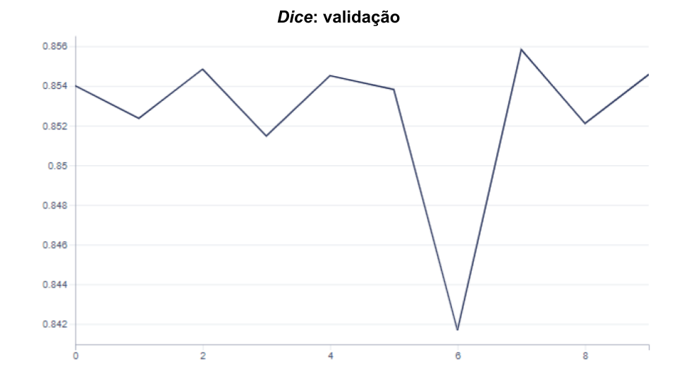 |
|:-----------------------------------------------:|
| Figura 14: Função de custo e métrica Dice da validação.

A análise comparativa entre os níveis de porosidade esperada e predita no conjunto de validação também mostra resultados satisfatórios. O gráfico de correlação mostra uma correlação predição-realidade praticamente linear, considerando a porosidade de cada imagem separadamente, com coeficiente de determinação (R²) de 0.9995 - muito próximo do valor perfeito de 1.0 -, e raiz do erro médio quadrático (RMSE) de 0.0104 - muito próxima de zero. Por sua vez, o gráfico de barras mostra diferenças pouco perceptíveis entre a porosidade real e a predita quando considerado o conjunto de validação inteiro.

|  |
|:-----------------------------------------------:|
| Figura 15: Correlação poro x não-poro de validação (a esquerda) e gráfico de barras comparando os resultados da porosidade real x predita (a direita).

Por sua vez, a matriz de confusão revela que o fator que mais afeta os resultados da rede são os falsos negativos, isto é, pixels que deveriam ser classificados como poros e não são, o que compreende aproximadamente 14% do conjunto de validação.

| 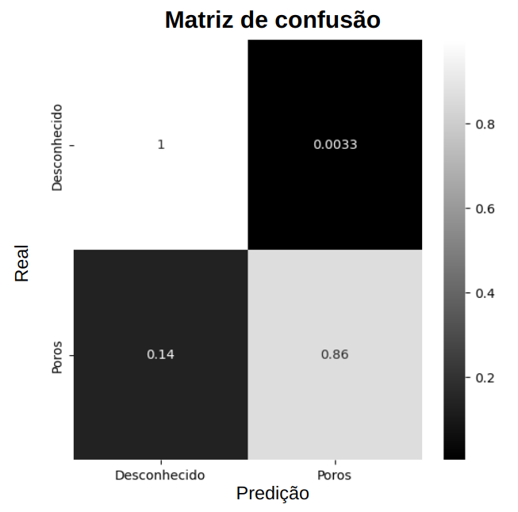|
|:-----------------------------------------------:|
| Figura 16: Matriz de confusão de validação.

As imagens a seguir mostram avaliações qualitativas dos resultados. O quadro ORIGINAL mostra um recorte de lâmina. O quadro LABEL destaca, em verde, os poros rotulados no recorte. Por sua vez, o quadro PREDICTION mostra: (i) em verde: os verdadeiros positivos (poro classificado como tal), (ii) em vermelho: os falsos positivos (predição indevida de poro) e (iii) em amarelo: os falsos negativos (não-predições indevidas de poro). Por último, o quadro CONFIDENCE mostra o nível de confiança da predição: quanto mais clara a região, maior a certeza na predição.

| 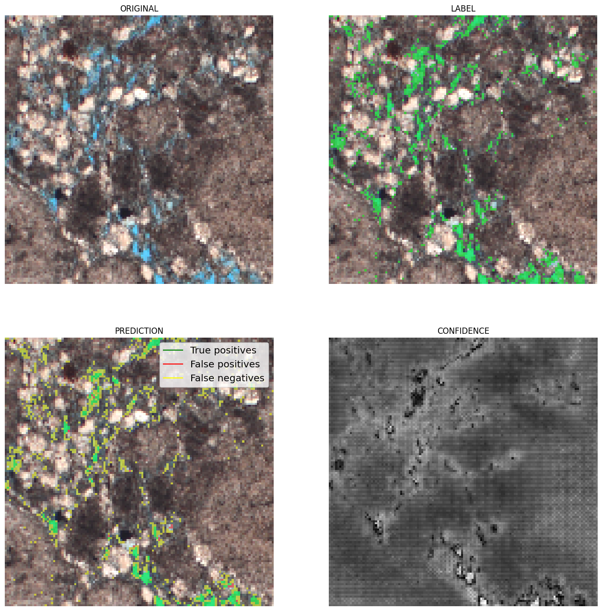 |
|:-----------------------------------------------:|
| Figura 17: Exemplos de resultados de validação.

A partir dos exemplos, se nota que os mais baixos níveis de confiança são vistos nas bordas dos poros. Em adição, o último exemplo ilustra situações recorrente nas predições:

- Falsos negativos nas bordas dos poros;
- Falsos negativos detectados em pixels pontuais. 

No conjunto de testes, os resultados foram similares:

| 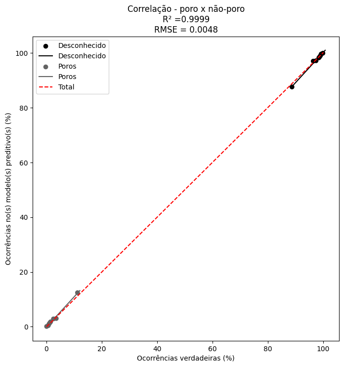 |
|:-----------------------------------------------:|
| Figura 18: Correlação poro x não-poro de teste (a esquerda) e gráfico de barras comparando os resultados da porosidade real x predita (a direita).

Por sua vez, a matriz de confusão revela que o fator que mais afeta os resultados da rede são os falsos negativos, isto é, pixels que deveriam ser classificados como poros e não são, o que compreende aproximadamente 14% do conjunto de validação.

| 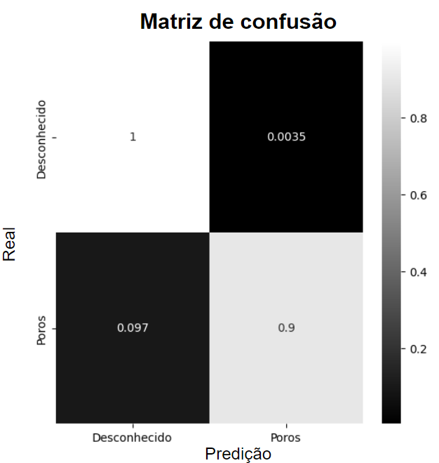|
|:-----------------------------------------------:|
| Figura 19: Matriz de confusão de teste.

#### Discussão e limitações

No geral, o modelo desempenha sua função de forma muito satisfatória sobre imagens com a resolução conhecida durante o treinamento, principalmente no que diz respeito ao cálculo do nível de porosidade. Acredita-se que o principal fator limitante para um desempenho ainda melhor é o fato de que a rotulação dos poros, usada como base para o treinamento, carrega as limitações da segmentação por limiar de cores. As bordas dos poros costumam apresentar cores intermediárias entre o azul da resina e as das texturas de rocha, de modo a serem compreendidas pelos limiares em algumas imagens e não em outras, dificultando o aprendizado sobre essas regiões. Dificuldade similar provém do fato de que pequenos pontos sobre as texturas podem ter coloração indevidamente compatível com os limiares, sendo rotulados como poros. Futuramente, o modelo pode ser melhorado com a inclusão de mais dados de treinamento e um refinamento e/ou pós-tratamento na rotulação por cor.

### Inferência Bayesiana

Visando a segmentação poro/não-poro, além das redes neurais, podem ser utilizadas também redes mais simples, como é o caso da Inferência Bayesiana. Nesse tipo de modelo, os pesos da rede são descritos de acordo com uma matriz de covariância e uma média relativa a cada segmento. Dessa forma, depois de treinada, essa correlação entre os pixels/voxels pode ser usada a fim de medir a probabilidade de cada um dos segmentos.

Além disso, o algoritmo de Inferência Bayesiana ainda permite uma estimativa de erros sobre o resultado final e ajuste fino posterior dessas porcentagens de segmentos, uma vez que provê uma incerteza como resultado da inferência.

Como vantagem do caráter probabilístico nessa abordagem, existe a possibilidade de pesar certos segmentos em relação a outros a partir da inclusão de parâmetros a priori, que são úteis em sua adaptação a dados diferentes sem a necessidade de um novo treinamento.

#### Teoria

A inferência Bayesiana é um dos mais antigos modelos usados na área da visão computacional, sendo os primeiros artigos sobre o método publicados no final da década de 1970, quando os computadores começaram a poder processar grandes quantidades de dados como imagens (Hunt, 1977). Posteriormente, nas décadas seguintes, o método foi melhorado e o uso de diferentes modelos a priori e funções de verossimilhança foram criadas (Skilling et. al., 1984; Hanson, 1990; Hanson, 1993; Geman et. al., 1990). Atualmente, variações do método são empregadas em uma vasta quantidade de aplicações, como é o caso da inversão sísmica Bayesiana (De Figueiredo et. al., 2017).

Para introduzirmos esse método, vamos supor que já temos algum conhecimento sobre qual deve ser o resultado de nosso algoritmo. Dentro da abordagem Bayesiana, expressamos esse conhecimento a partir de uma distribuição de probabilidades chamada distribuição a priori:

$$ P(A). $$

Dessa forma, ao nos depararmos com um dado novo, devemos atualizar tal probabilidade, com base na nova “observação” ou “evidência”. A distribuição atualizada que leva em conta tanto as observações quanto o conhecimento a priori é chamada de distribuição a posteriori, definida por:

$$ P(A|B). $$

A ideia do método de inferência Bayesiana é que podemos incluir o novo conhecimento a partir da multiplicação da distribuição a priori por uma função de verossimilhança $P(B|A)$. Dessa forma, a atualização sobre o modelo será dada por:

$$ P(A|B) = \frac{P(B|A)P(A)}{P(B)}, $$
onde $P(B)$ é uma normalização. Essa fórmula é conhecida como lei ou **regra de Bayes** --- Para o leitor interessado em maiores detalhes matemáticos sobre os diferentes modelos de inferência Bayesiana é recomendada a leitura dos livros de Murray Aitkin (Aitkin, 2010), Helio S. Migon, Dani Gamerman e Francisco Louzada (Migon, et. al., 2014), além do cap. 2 de Dani Gamerman e Hedibert Freitas Lopes (Gamerman et. al., 2006).

A regra de Bayes é frequentemente utilizada para problemas de classificação. Entretanto, a segmentação de imagens pode ser interpretada como uma sequência de classificações sobre diferentes partes da imagem. Seguindo um algoritmo de janela deslizante sobre a imagem, obtemos uma segmentação completa de todos os seus pixels.

No GeoSlicer, esta abordagem é utilizada juntamente com a suposição de uma Distribuição Normal Multivariada para função de verossimilhança:

$$ f(x_p|s)=\frac{1}{\sqrt{(2\pi)^k \det \Sigma_s}}\exp\left(-\frac{1}{2}(x_p-\mu_s)^T \Sigma_s^{-1} (x_p-\mu_s)\right), $$
onde $x_p$ é um vetor que contém os valores empilhados da imagem dentro de um kernel centrado no pixel $p$ a ser analisado, enquanto $\mu_s$ e $\sigma_s$ são a média e a matriz de covariância características de um segmento s, os quais são calculados baseados nos dados de anotações.

O cálculo da média de cada segmento é trivial, enquanto o da matriz covariância é definido por:

$$ \Sigma_{w,w} = \frac{A A^T}{N_p-1}, $$

onde A é a matriz dos dados anotados construída conforme o diagrama da Figura 20. Assim como no caso da feature de variograma, essas matrizes também contêm informações das correlações espaciais de cada segmento.

| |
|:-----------------------------------------------:|
| Figura 20: Algoritmo de janela deslizante.

Com as médias e as matrizes de covariância calculadas, a inferência da probabilidade de cada segmento para um dado pixel da imagem é obtida pela regra de Bayes:

$$ P(s|x)=\frac{P(x|s) P(s)}{P(x)}, $$

onde o fator de normalização é

$$ P(x)=\sum_s P(x|s) P(s). $$

Em casos de tamanho de kernel grande, o cálculo das probabilidades a posteriori seguindo a equação anterior pode ser um desafio. De fato, alguns problemas numéricos podem ocorrer relacionados ao cálculo da exponencial e a inversão das matrizes de covariância.

Com relação ao cálculo da exponencial, esse pode ser evitado ao tirarmos o logaritmo da probabilidade, de forma que ficamos com:

$$ S = -\log f(x) = \frac{1}{2} \log\det(2\pi\Sigma) + \frac{1}{2} (x-\mu)^T \Sigma^{-1} (x-\mu), $$

onde o termo com o logaritmo do determinante pode ser calculado a partir de funções bastante robustas disponibilizadas em bibliotecas como o numpy. E o segundo termo pode ser calculado simplesmente como uma multiplicação de matrizes, ou para o caso de kernels grandes, como uma convolução sobre a imagem, seguida de uma multiplicação de matrizes mais simples.

Uma vez que a função logaritmo é classificada como uma função côncava, podemos dizer que o máximo do seu argumento continua sendo o máximo da própria função, de forma que:

$$ \arg\max(f(x))=\arg\min(-\log f(x)), $$

onde o sinal é colocado apenas como uma conveniência. Ou seja, ao determinarmos o segmento que minimiza a função $S$, determinamos também o segmento que maximiza a função de distribuição de probabilidade $f$.

Desta maneira, calculamos para cada pixel da imagem, o segmento que maximiza a probabilidade a posteriori, e que portanto melhor representa o kernel da imagem estatisticamente.

#### Treinamento

Como forma de auxiliar o modelo na melhor compreensão dos diferentes tipos de imagens de entrada, realizamos alguns tratamentos de pré-processamento sobre esses e além disso também realizamos alguns tratamentos sobre a matriz de covariância.

No caso dos dados de lâminas, que apresentam mais de um canal, os dados estão em formato RGB, no entanto, notamos que os resultados da rede são muito superiores ao utilizar a imagem em formato HSV, onde a classificação é feita pela cor, saturação e valor. Dessa forma, convertemos a imagem de lâmina para esse formato antes de treinar/inferir o modelo.

Além dos pré-processamentos feitos nos dados de entrada, também realizamos um procedimento de filtragem (ou *tapering*) da matriz covariância quando o tamanho do kernel é muito grande (>10 px). Fazemos isso a partir do uso de uma função envelope que pode ser uma gaussiana, por exemplo. Esse procedimento se justifica em virtude da enorme quantidade de detalhes que a matriz covariância é capaz de capturar nesse regime, e como alguns desses detalhes são menos relevantes para a segmentação, eles podem acabar prevendo um resultado muito ruidoso e impreciso.

Com base em todos esses processamentos, disponibilizamos no Geoslicer dois modelos treinados em um pequeno conjunto de dados (~10 amostras), para a segmentação poro/não-poro em lâminas. Abaixo, apresentamos alguns resultados desse modelo pré-treinado.

#### Resultados

| 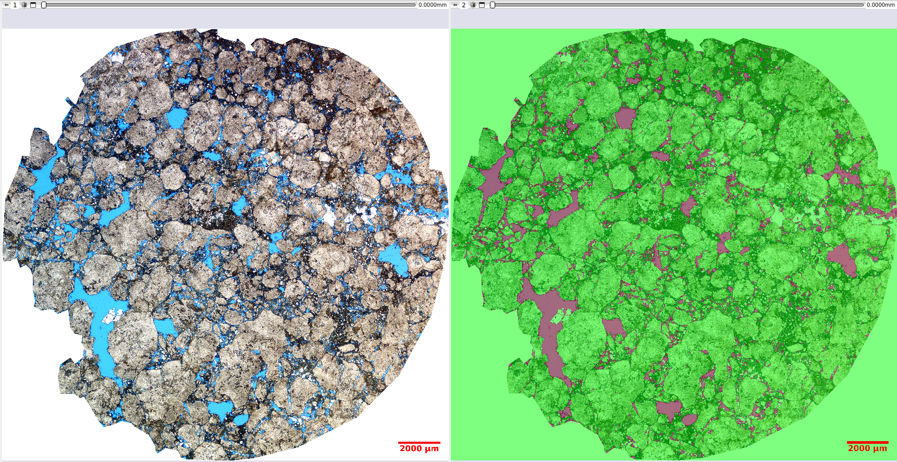 |
|:-----------------------------------------------:|
| Figura 21: Resultados qualitativos da segmentação poro/não-poro por inferência Bayesiana.

#### Discussão

Dessa maneira, podemos concluir que a inferência Bayesiana pode ser empregada como um dos métodos no contexto da segmentação de imagens, produzindo resultados interessantes, mesmo que com uma abordagem bastante simples e sem extensos dados de treinamento. 
	
Ainda, deixamos indicada a possibilidade futura de implementação de um ajuste fino nos resultados finais das segmentações, que pode ser uma interessante função para o usuário. Uma vez que esse controle o permitiria, por exemplo, após o procedimento de inferência, fazer um ajuste manual sobre a quantidade de cada segmento, corrigindo eventuais falhas na previsão do modelo.

Além disso, uma possibilidade para investigação futura seria a criação de alguns modelos a priori para as correlações entre pixels/voxels. Em testes preliminares, tentamos por meio de uma intuição sobre o caráter dos dados, criar modelos que não necessitassem do treinamento prévio. Entretanto, esses modelos não chegaram a superar os modelos treinados e portanto resolvemos não seguir com ele.

#### Referências

- De Figueiredo, L. P., Schmitz, T., Lunelli, R., Roisenberg, M., Santana de Freitas, D., & Grana, D. (2020). Direct Multivariate Simulation - A stepwise conditional transformation for multivariate geostatistical simulation. Computers & Geosciences, 104659.  https://doi.org/10.1016/j.cageo.2020.104659  
- De Figueiredo, L. P., Grana, D., Santos, M., Figueiredo, W., Roisenberg, M., & Schwedersky Neto, G. (2017). Bayesian seismic inversion based on rock-physics prior modeling for the joint estimation of acoustic impedance, porosity and lithofacies. Journal of Computational Physics, 336, 128–142. https://doi.org/10.1016/j.jcp.2017.02.013 
- B. R. Hunt. (1977) Bayesian methods in nonlinear digital image restoration. IEEETrans. Comp.,C-26:219-229.
- Skilling, J.; Bryan, R. K. Maximum entropy image reconstruction: general algorithm. Monthly Notices of the Royal Astronomical Society, v. 211, n. 1, p. 111–124, nov. 1984. https://doi.org/10.1093/mnras/211.1.111 
- Hanson, Kenneth. (1993). Introduction to Bayesian image analysis. Proc SPIE. 1898. 716-731. https://doi.org/10.1117/12.154577.
- Hanson, Kenneth. (1990) Object detection and amplitude estimation based on maximum a-posteriori reconstructions," Proc. SPIE 1231, Medical Imaging IV: Image Formation; https://doi.org/10.1117/12.18794.
- Geman, S., and Geman, D.. 1990. Stochastic Relaxation, Gibbs Distribution and the Bayesian Restoration of Images. IEEE, Transactions on Pattern Analysis; Machine Intelligence, vol. PAMI-6, no. 6, pp. 721-741, Nov. 1984, http://doi.org/10.1109/TPAMI.1984.4767596. 
- (livro) Aitkin, Murray A. 2010. Statistical inference: an integrated Bayesian/likelihood approach. CRC Press: Taylor e Francis Group.
- (livro) Migon, Helio S., Dani Gamerman, and Francisco Louzada. 2014. Statistical Inference: An Integrated Approach. 2nd ed. CRC Press: Taylor e Francis Group.
- (livro) Gamerman, Dani, and Hedibert F. Lopes. 2006. Monte Carlo Markov Chain: Stochastic Simulation for Bayesian Inference. 2nd ed. London: Chapman & Hall.
