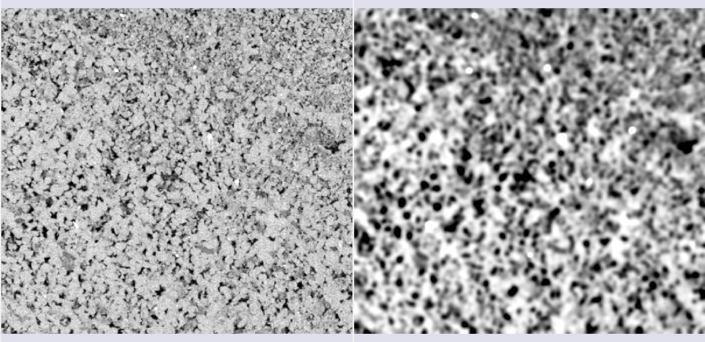
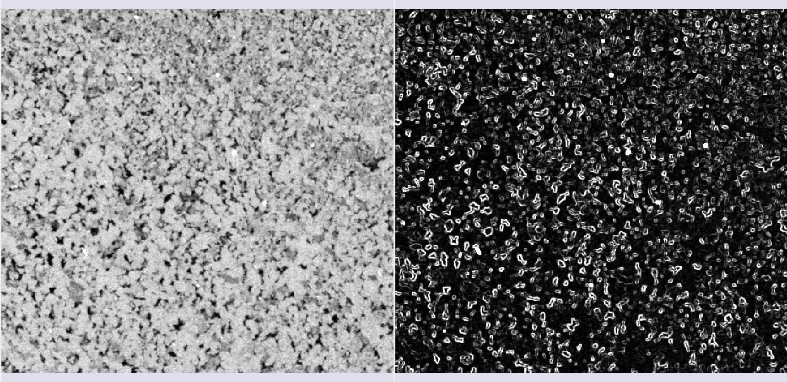
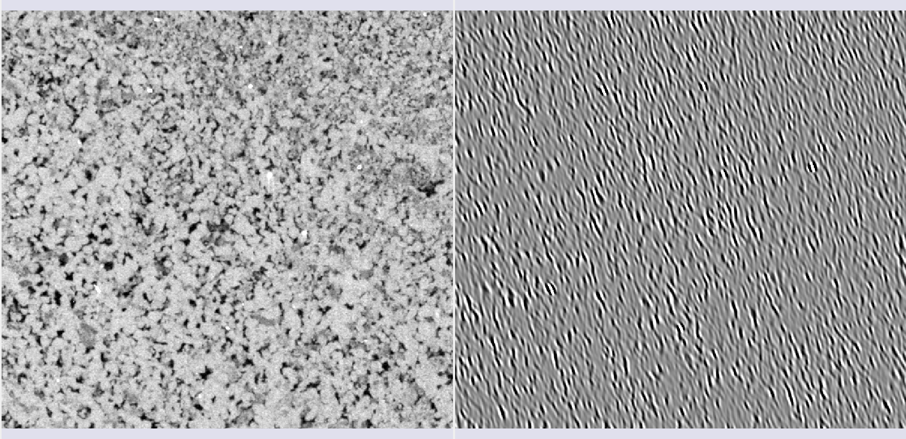
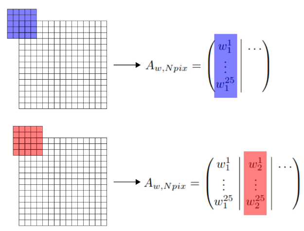
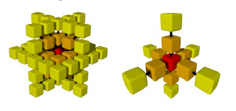
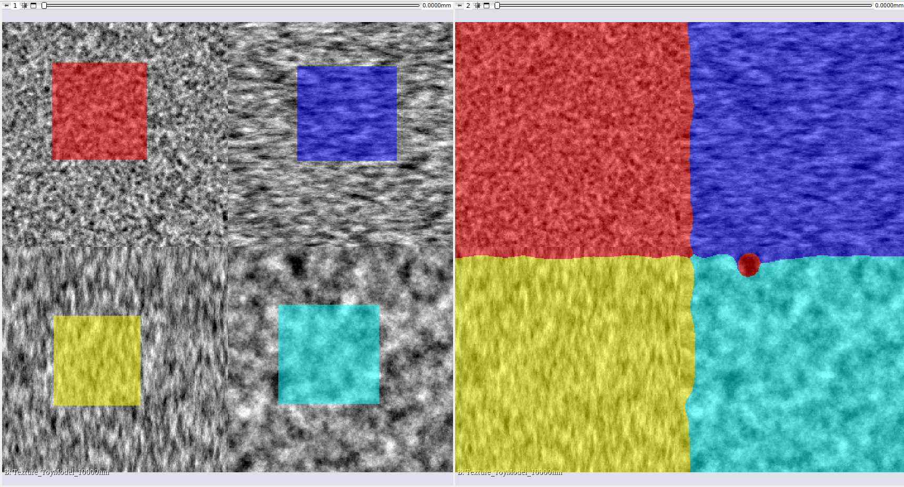

# Segmentação Semi-automática

Os métodos incluídos no módulo de segmentação semi-automática do GeoSlicer realizam uma segmentação de toda a amostra, baseando-se em uma anotação inicial simples, que pode ser feita no módulo de segmentação manual. A partir dessa anotação inicial, os diferentes métodos realizam um treinamento do modelo e inferem o resultado no dado completo ou em uma região especificada pelo *Segmentation of interest* (SOI).

Alguns modelos pré-treinados também são disponibilizados para usos específicos, ao selecionar a caixa "*Use a previously trained classifier*", uma caixa de seleção com alguns desses modelos é habilitada para escolha. Nesse caso, o método utilizado será aquele do modelo que foi selecionado.

## Método Random-Forest

Um dos métodos incluídos no módulo de segmentação semi-automática do GeoSlicer é o Random-Forest. Esse algoritmo, classificado como um método de *ensemble* (conjunto), funciona a partir da construção de uma diversidade de árvores de decisões durante o treinamento. Essa classe de métodos, possui como característica principal a combinação de diferentes modelos para obtenção de um único resultado, dessa forma, esses algoritmos tendem a ter resultados que são geralmente muito mais robustos e complexos.

O conceito principal por trás do funcionamento do método de Random-Forest é o das árvores de decisão. Essas árvores podem ser representadas como uma estrutura de fluxograma, com nós em que uma dada condição é verificada. Dessa forma, os diferentes modelos são criados de acordo com a organização dos nós de decisão em cada árvore. 

A saída do algoritmo de Random-Forest é escolhida de acordo com a classe que foi selecionada pela maioria das árvores. Sendo assim um resultado combinado sobre diferentes modelos.

|  |
|:-----------------------------------------------:|
| Figura 1: Método de Random-Forest. Por Venkata Jagannath - <https://community.tibco.com/wiki/random-forest-template-tibco-spotfirer-wiki-page>, CC BY-SA 4.0, <https://commons.wikimedia.org/w/index.php?curid=68995764>. |

### Seleção de características (*features*)

Especialmente para o método Random-Forest, uma tabela para fazer a seleção das *features* foi adicionada como entrada, dessa forma, o usuário pode selecionar de maneira mais flexível quais características da imagem o algoritmo terá para fazer o treinamento dessa rede. Abaixo detalhamos cada um dos filtros que podem ser aplicados a imagem para extração das *features*:

* **Raw input image** : Adiciona a própria imagem como uma das entradas;
* **Quantized image** : Para imagens com mais de um canal (e.g. RGB, QEMSCAN, etc.): adiciona a imagem quantizada como entrada; Para imagens com apenas um canal: adiciona a própria imagem;
* **Petrobras model** : Modelo combinado de algumas *features* que apresentaram bons resultados;
* **Gaussian filter** : Aplica um kernel gaussiano de raio escolhido como um filtro na imagem;

|  |
|:-----------------------------------------------:|
| Figura 2: Filtro gaussiano. |

* **Winvar filter** : Filtro baseado na variância, calcula $\left\lt x^2\right\gt-\left\lt x\right\gt^2$ dentro de um kernel de raio escolhido;

|  |
|:-----------------------------------------------:|
| Figura 3: Filtro winvar. |

* **Gabor filters** : os filtros Gabor no GeoSlicer são calculados em direções $\theta$ igualmente espaçadas. Esses filtros são compostos de uma parte gaussiana, e uma parte senoidal, em 2D:

$$ f(x,y,\omega,\theta,\sigma)=\frac{1}{2\pi\sigma^2}\exp\left[-\frac{1}{2}\frac{x^2+y^2}{\sigma^2}+I\omega(x\cos\theta+y\sin\theta)\right]. $$

|  |
|:-----------------------------------------------:|
| Figura 4: Filtro Gabor em uma das direções $\theta$. |

* **Minkowsky functionals** : os funcionais de Minkowsky são parâmetros morfológicos que descrevem a geometria integral dos dados; Geometricamente, podemos associar cada um dos parâmetros a, respectivamente: o volume, a superfície, a curvatura média e a característica de Euler, dada por $\xi(S)=V-A+F$, onde $V,A$ e $F$ representam o número de vértices, de arestas e de faces de uma triangulação de S. Para calcular os funcionais de Minkowsky utilizamos um algoritmo de binarização por *threshold* da imagem original.

|   |
|:-----------------------------------------------:|
| Figura 5: Filtros Minkowsky. Da esquerda para a direita e de cima para baixo: imagem, $M_0$, $M_1$, $M_2$. |

* **Variogram range** : O variograma (ou função de covariância), mede a variação média de valores de uma variável em função da distância entre elas. O range do variograma é definido por uma distância onde, a partir de seu valor, esta variação é máxima (ou a covariância é zero). O método de feature do range do variograma é baseado no cálculo eficiente do variograma a partir de sua relação com a função de covariância no domínio das frequências:
$$ C_\omega = \frac{1}{N}I_\omega I_\omega^*, $$
com $I_\omega$ sendo a imagem no domínio das frequências.

|  |
|:-----------------------------------------------:|
| Figura 6: Variogram range. |

As motivações do uso desta feature são as seguintes:

* Texturas com grande heterogeneidade tendem a ter ranges menores do que imagens mais homogêneas. 

* Amostras com granulometrias mais finas tendem a ter ranges menores do que imagens com granulometrias grossas

## Método Inferência Bayesiana

O objetivo principal de diferentes técnicas de aprendizagem de máquina é encontrar um modelo que represente corretamente os dados, com o intuito de fazer previsões futuras em dados inéditos. Na inferência Bayesiana, tal modelo é descrito com base na atribuição de distribuições de probabilidades que possam representar a composição final do dado. Essas probabilidades são adaptadas de acordo com a observação dos dados e de nossas crenças a respeito da classificação desses.

Algumas vezes, já temos algum conhecimento sobre qual esse modelo deve ser mesmo antes de ver os dados. Na inferência Bayesiana expressamos esse conhecimento com uma distribuição de probabilidade chamada distribuição a priori
$$ P(A). $$

Ao se deparar com um dado novo, devemos atualizar essa probabilidade baseando-se na nova "observação" ou "evidência". A distribuição atualizada que leva em conta tanto as observações quanto o conhecimento a priori é chamada de distribuição a posteriori, definida por:
$$ P(A|B). $$

O procedimento da inferência Bayesiana nos permite incluir esse novo conhecimento a partir da multiplicação da distribuição a priori por uma função de verossimilhança $P(B|A)$. Dessa forma, a atualização das crenças sobre o modelo será dada por:
$$ P(A|B) = \frac{P(B|A)P(A)}{P(B)}, $$
onde $P(B)$ é uma normalização. Essa fórmula é conhecida como lei ou **regra de Bayes**.

Para maiores detalhes teóricos a respeito da técnica utilizada e referenciais sobre o tema, recomendamos a leitura do tópico [Inferência Bayesiana](../Automatic/automatic_thinSection.md#teoria).

### Aplicação na segmentação de imagens

A regra de Bayes é frequentemente utilizada para problemas de classificação. Entretanto, a segmentação de imagens pode ser interpretada como uma sequência de classificações de diferentes partes da imagem. Seguindo um algoritmo de janela deslizante sobre a imagem, obtemos uma segmentação completa de todos os seus pixels. 

No GeoSlicer, esta abordagem é utilizada juntamente com a suposição de uma **Distribuição Normal Multivariada** para a função de verossimilhança:
$$ f(x_p|s) = \frac{1}{\sqrt{(2\pi)^k \det\Sigma_s}}\exp \left(-\frac{1}{2}(x_p-\mu_s)^T\Sigma_s^{-1}(x_p-\mu_s)\right), $$
onde $x_p$ é um vetor que contém os valores empilhados da imagem dentro de um kernel centrado no pixel $p$ a ser analisado, enquanto $\mu_s$ e $\Sigma_s$ são a média e a matriz de covariância características de um segmento $s$, os quais são calculadas baseadas nos dados de anotações.

O cálculo da média $\mu_s$ de cada segmento $s$ é trivial, enquanto o da **matriz covariância** é definida por:
$$ \Sigma_{w,w} = \frac{A A^T}{N_p-1}, $$
onde $A$ é a matriz dos dados anotados construída conforme o diagrama da Figura 2. Assim como no caso da feature de variograma, essas matrizes também contêm informações das correlações espaciais de cada segmento.

|  |
|:-----------------------------------------------:|
| Figura 2: Algoritmo de janela deslizante. |

Com as médias e as matrizes de covariância calculadas, a inferência da probabilidade de cada segmento para um dado pixel da imagem é obtida pela regra de Bayes:
$$ P(s|x) = \frac{P(x|s)P(s)}{P(x)}, $$
onde o fator de normalização é
$$ P(x) = \sum_s P(x|s)P(s). $$

Em casos de tamanho de kernel grande, o cálculo das probabilidade a posteriori seguindo a equação anterior pode ser um desafio. De fato, alguns problemas numéricos podem ocorrer relacionados ao cálculo da exponencial e a inversão das matrizes de covariância. 
Entretanto, ainda é possível avaliar qual segmento é o mais provável ao avaliar o logaritmo da distribuição a posteriori.
Desta maneira, calculamos para cada pixel da imagem, o segmento que maximiza a probabilidade a posteriori, e que portanto melhor representa o kernel da imagem estatisticamente.

### Tratamentos realizados

No caso das imagens de MicroCT, realizamos uma transformação de quantil, de maneira que o histograma da imagem fica distribuído sobre uma normal. Dessa forma, os valores mais frequentes do histograma ficam um pouco mais espalhados, e além disso resolvemos o problema de saturação da imagem, jogando os outliers em valores de saturação mais razoáveis.

No caso dos dados de Lâminas, que apresentam mais de um canal, outro tipo de pré-processamento é necessário. Originalmente, os dados de Lâminas estão em formato RGB, no entanto, notamos que os resultados da rede são muito superiores ao utilizar a imagem em formato HSV, onde a classificação é feita pela cor, saturação e valor. Dessa forma, convertemos a imagem de lâmina para esse formato antes de treinar/inferir o modelo.

Além dos pré-processamentos feitos nos dados de entrada, também realizamos um procedimento de filtragem (ou *tapering*) da matriz covariância quando o tamanho do kernel é muito grande (>10 px). Fazemos isso a partir do uso de uma função envelope que pode ser uma gaussiana, por exemplo. Esse procedimento se justifica em virtude da enorme quantidade de detalhes que a matriz covariância é capaz de pegar nesse regime, como alguns desses detalhes são menos relevantes para a segmentação, eles podem acabar prevendo um resultado muito ruidoso e impreciso.

### Otimização de matrizes esparsas

Nem sempre se faz necessário --- principalmente em três dimensões --- o cálculo da covariância com todos os pixels/voxels dentro de um cubo/plano, assim, implementamos uma otimização na qual a covariância é calculada apenas nos eixos ou nos planos principais de cada pixel/voxel. Essa otimização pode ser utilizada a partir da seleção do parâmetro "*kernel type*" na interface do módulo.

|  |
|:-----------------------------------------------:|
| Figura 3: Representação dos kernels esparsos utilizados para acelerar a inferência. |

### Resultados

#### Imagens sintéticas

Como teste inicial do algoritmo e também como ferramenta de controle sobre os resultados desse, utilizamos imagens sintéticas geradas a partir de um algoritmo de simulação de distribuições multivariadas, sobre o qual geramos 4 regiões diferentes. Uma vez que o modelo Bayesiano utiliza a distribuição multivariada normal como base, esperamos que ele seja capaz de prever com qualidade os resultados sobre esse tipo de dado sintético.

|  |
|:-----------------------------------------------:|
| Figura 4: Segmentação semi-automática usando inferência Bayesiana em dados sintéticos. |

#### Imagens de tomografia e lâminas

Foram feitos também alguns testes com anotações manuais em amostras reais, assim nos certificarmos de que o uso do algoritmo seria de fato viável como ferramenta do Geoslicer. Abaixo, mostramos alguns resultados obtidos para segmentação com anotações.

|  |
|:-----------------------------------------------:|
| Figura 5: Segmentação semi-automática usando inferência Bayesiana em dados de MicroCT. |

|  |
|:-----------------------------------------------:|
| Figura 6: Segmentação semi-automática usando inferência Bayesiana em dados de lâminas. |
