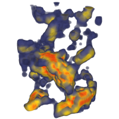
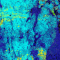
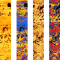
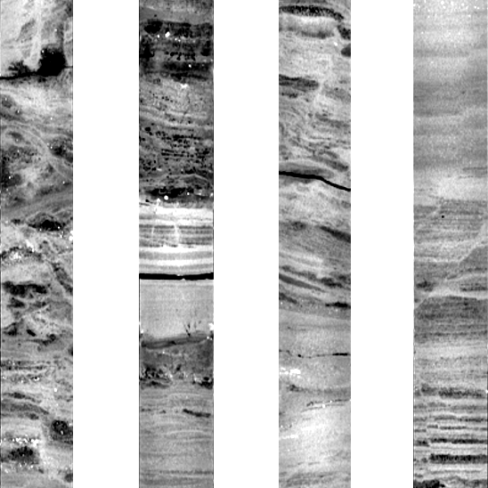
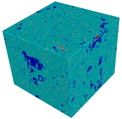

# GeoSlicer 
#### Plataforma integrada para visualização, análise e interpretação de imagens de rocha digital em multiescalas

O termo rocha digital refere-se a imagens de rochas obtidas por diferentes técnicas de imagem, como fotografia, tomografia computadorizada e microscopia eletrônica. A interpretação dessas imagens é essencial para a compreensão de processos geológicos, como a formação de reservatórios de petróleo e gás. Para dar suporte a pesquisa e análise desse tipo de dado foi desenvolvida uma plataforma integrada projetada para atender diversos fluxos de trabalho envolvendo rocha digital. Essa plataforma é o _**GeoSlicer**_.

O GeoSlicer é uma plataforma de [código aberto](https://github.com/petrobras/GeoSlicer), desenvolvida em Python e baseada no software 3D Slicer.

## Ambientes

- [Volumes](./Volumes/Introduction.md)
- [Thin Section](./ThinSection/Introduction.md)
- [Well Logs](./ImageLog/Introduction.md)
- [Core](./Core/Introduction.md)
- [Multiscale](./Multiscale/Introduction.md)

