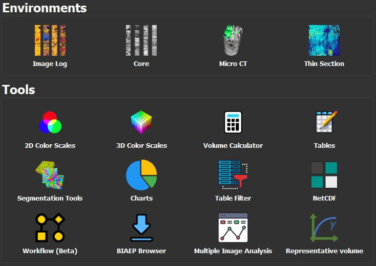

# Manual do GeoSlicer

O GeoSlicer é uma plataforma integrada para visualização, processamento, análise e interpretação de imagens de rocha digital em várias escalas, que permite a fácil implementação de outros protótipos. O GeoSlicer é desenvolvido baseado no software 3D Slicer, software utilizado para análise de imagens médicas.

O software é separado em diferentes ambientes: o Image Log onde as ferramentas para perfil de imagem são separadas; o ambiente Core onde as ferramentas de tomografia médica estão
disponíveis; o ambiente o Micro CT onde as ferramentas para microtomografia são separadas; e o ambiente Thin section para trabalhar com dados de microfotografia
de lâminas delgadas. O usuário pode navegar entre esses ambientes pela tela inicial do GeoSlicer.

|  |
|:-----------------------------------------------:|
| Figura 1: Print da tela inicial do GeoSlicer onde os diferentes ambientes estão disponíveis. |

Além disso, ferramentas mais gerais, que podem ser utilizadas em todos os ambientes como calculadora, edição de tabelas, gráficos, filtros e exportação de dados, foram sepa-
radas dos ambientes e estão disponíveis como atalhos na página inicial ou na barra superior da aplicação.

Por padrão, o software está definido com o modo escuro ativado visando melhor conforto visual ao usuário. Esta configuração pode ser alterada em Edit / Application Settings / Appearance / Style. 

