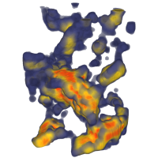
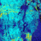
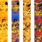
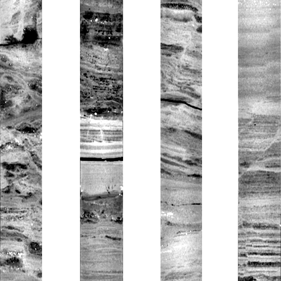
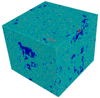

# GeoSlicer 
#### Integrated platform for viewing, analyzing, and interpreting multiscale digital rock images

The term “digital rock” refers to images of rocks obtained using different imaging techniques, such as photography, computed tomography, and electron microscopy. The interpretation of these images is essential for understanding geological processes, such as the formation of oil and gas reservoirs. To support the research and analysis of this type of data, an integrated platform was developed to serve various workflows involving digital rock. This platform is _**GeoSlicer**_.

GeoSlicer is an [open-source platform](https://github.com/petrobras/GeoSlicer), developed in Python and based on the software 3D Slicer.

## Ambientes

- [{ width="50" style="vertical-align:middle; margin-right:8px;" }Volumes](./Volumes/Introduction.md)
- [{ width="50" style="vertical-align:middle; margin-right:8px;" }Thin Section](./ThinSection/Introduction.md)
- [{ width="50" style="vertical-align:middle; margin-right:8px;" }Well Logs](./ImageLog/Introduction.md)
- [{ width="50" style="vertical-align:middle; margin-right:8px;" }Core](./Core/Introduction.md)
- [{ width="50" style="vertical-align:middle; margin-right:8px;" }Multiscale](./Multiscale/Introduction.md)

