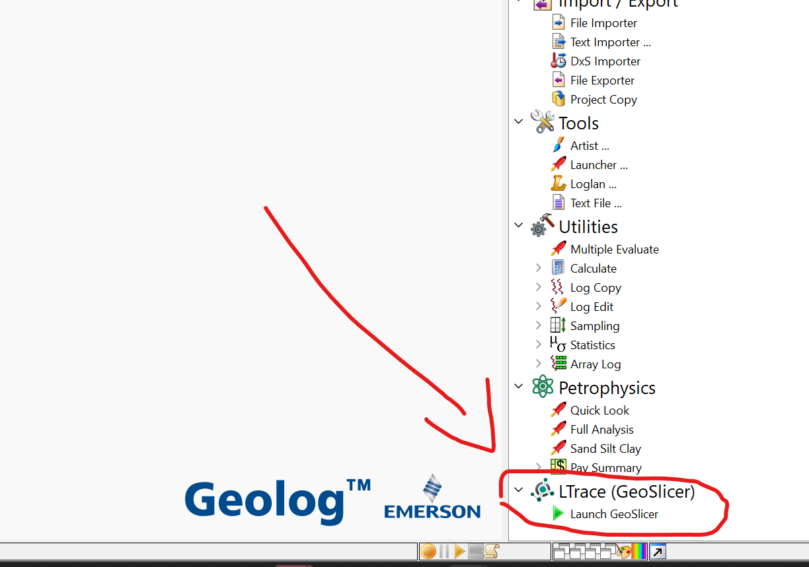

# Installing the GeoSlicer addon to Geolog

An "LTrace (GeoSlicer)" menu will be added to the Processing menu of the Geolog application, along with a button to launch GeoSlicer.

For *Windows* users, the installation is made running the installer GeoSlicer_addon.exe. *Unix users or Unix/Windows developers* will run a Python script instead.

## Windows users

You just need the GeoSlicer_addon.exe (it has plugin_to_geolog.py embedded)

## Unix users (not tested on Mac)

run `python ./plugin_to_geolog.py --geolog-path "<Geolog installation path>" --geoslicer-path "<GeoSlicer path>"`

- If you don't have Python installed, you can use GeoSlicer's Python: `<GeoSlicer path>/bin/python-real ./plugin_to_geolog.py --geolog-path "<Geolog installation path>" --geoslicer-path "<GeoSlicer path>"`

## For developers

Run `python ./plugin_to_geolog.py --geolog-path "<Geolog installation path>" --geoslicer-path "<GeoSlicer path>"`

or, you can install the add-on during the GeoSlicer deployment step. For that, a `--plugin-to-geolog` flag has been added to the deploy script. An example call:
`python ./deploy_slicer.py --dev "~/ltrace/my_geoslicer" --plugin-to-geolog "/home/ubuntu/Paradigm/Geolog22.0"`

## More info for developers

The installer GeoSlicer_addon.exe is generated running the script geolog_addon.iss with the InnoSetup application. It embeds plugin_to_geolog.py and menu_ltrace.svg. Please re-generate it after changes in any part of this project.

Other features are possible and may be welcome.
* Slicer (should work for GeoSlicer also) can be launched running a script without the GUI: `Slicer.exe --no-splash --no-main-window --python-script /path/to/script.py`. This way, we can install other buttons in the Geolog’s LTrace menu for different tasks
  * These scripts can also take advantage internally of the GeoSlicer’s GeoLogEnv integration module
